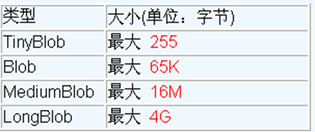

# 1. MySQL BLOB类型

- MySQL中，BLOB 是一个二进制大型对象，是一个可以存储大量数据的容器，它能容纳不同大小的数据。
- 插入 BLOB 类型的数据必须使用 PreparedStatement，因为 BLOB 类型的数据无法使用字符串拼接写的。
- MySQL 的四种 BLOB 类型(除了在存储的最大信息量上不同外，他们是等同的)
  - 
- 实际使用中根据需要存入的数据大小定义不同的 BLOB 类型。
- 需要注意的是：如果存储的文件过大，数据库的性能会下降。
- 如果在指定了相关的 Blob 类型以后，还报错：xxx too large，那么在 mysql 的安装目录下，找 `my.ini` 文件加上如下的配置参数： `max_allowed_packet=16M`。同时注意：修改了 `my.ini` 文件之后，需要重新启动 mysql 服务。

# 2. 向数据表中插入大数据类型

```java
//向数据表customers中插入Blob类型的字段
@Test
public void testInsert() throws Exception{

    Connection conn = JDBCUtils.getConnection();

    String sql = "insert into customers(name, email, birth, photo) values(?, ?, ?, ?)";

    PreparedStatement ps = conn.prepareStatement(sql);

    ps.setObject(1,"袁浩");
    ps.setObject(2, "yuan@qq.com");
    ps.setObject(3,"1992-09-08");

    FileInputStream is = new FileInputStream(new File("girl.jpg"));
    ps.setBlob(4, is);

    ps.execute();

    JDBCUtils.closeResource(conn, ps);
}
```

# 3. 修改数据表中的Blob类型字段

```java
@Test
public void testUpdate() throws Exception {
    Connection conn = JDBCUtils.getConnection();
    String sql = "update customers set photo = ? where id = ?";
    PreparedStatement ps = conn.prepareStatement(sql);
    // 填充占位符
    // 操作Blob类型的变量
    FileInputStream fis = new FileInputStream("playgirl.jpg");
    ps.setBlob(1, fis);
    ps.setInt(2, 21);
    ps.execute();
    fis.close();
    JDBCUtils.closeResource(conn, ps);
}
```

# 4. 从数据表中读取大数据类型

```java
//查询数据表customers中Blob类型的字段
@Test
public void testQuery() {
    Connection conn = null;
    PreparedStatement ps = null;
    InputStream is = null;
    FileOutputStream fos = null;
    ResultSet rs = null;

    try {
        conn = JDBCUtils.getConnection();

        String sql = "select id,name,email,birth,photo from customers where id = ?";
        ps = conn.prepareStatement(sql);
        ps.setInt(1, 21);
        rs = ps.executeQuery();

        if (rs.next()) {
            //方式二：
            int id = rs.getInt("id");
            String name = rs.getString("name");
            String email = rs.getString("email");
            Date birth = rs.getDate("birth");

            Customer cust = new Customer(id, name, email, birth);
            System.out.println(cust);

            //将Blob类型的字段下载下来，以文件的方式保存在本地
            Blob photo = rs.getBlob("photo");
            is = photo.getBinaryStream(); // 獲取二進制流
            fos = new FileOutputStream("copy.jpg");
            byte[] buffer = new byte[1024];
            int len;
            while ((len = is.read(buffer)) != -1) {
                fos.write(buffer, 0, len);
            }
        }
    } catch (Exception e) {
        e.printStackTrace();
    } finally {

        try {
            if (is != null)
                is.close();
        } catch (IOException e) {
            e.printStackTrace();
        }

        try {
            if (fos != null)
                fos.close();
        } catch (IOException e) {
            e.printStackTrace();
        }

        JDBCUtils.closeResource(conn, ps, rs);
    }
}
```

