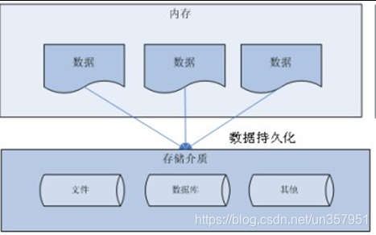
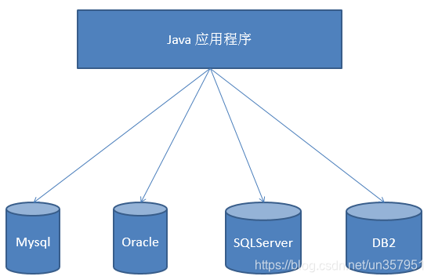
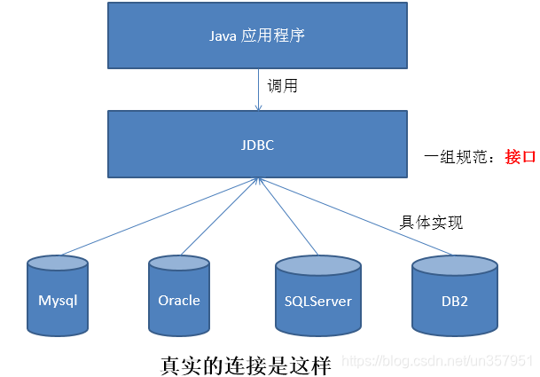
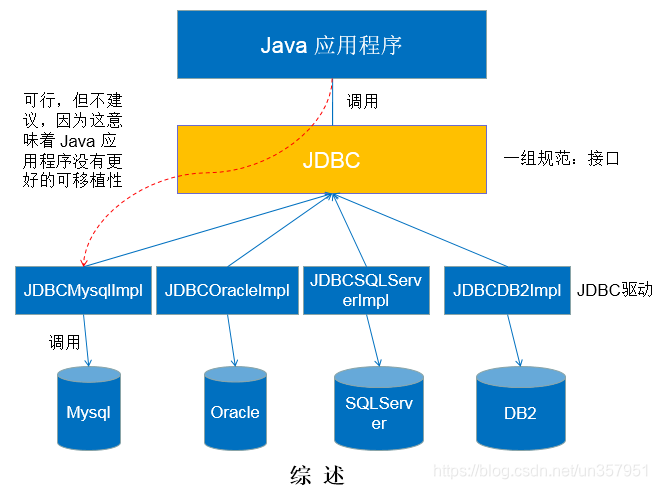
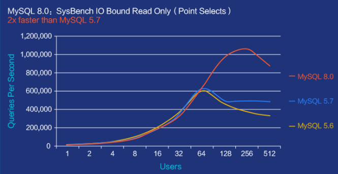

# 1.数据的持久化

### 持久化(persistence) :
- 把数据保存到可掉电式存储设备中以供之后使用。大多数情况下，特别是企业级应用，数据持久化意味着将内存中的数据保存到硬盘上加以固话，而持久化的实现过程大多通过各种关系型数据库来完成。

- 持久化的主要应用是将内存中的数据存储在关系型数据库中，当然也可以存储在磁盘文件、XML 数据文件中。

- 

# 2. Java中的数据存储技术
在 Java 中，数据库存取技术可分为如下几类 :
  1. JDBC 直接访问数据库
  2. JDO (Java Data Object) 技术
  3. 第三方O/R工具，如 Hibernate、Mybatis

> JDBC 是 Java 访问数据库的基石，JDO、Hibernate、Mybatis 等只是更好的封装了 JDBC。

# 3. JDBC的介绍

### 3.1 JDBC 技術介紹
> JDBC : Java Database Connectivity | Java 连接数据技术!

通俗点说，在Java代码中使用JDBC提供的方法，可以发送 **字符串类型** 的SQL语句到数据库管理软件(MySQL、Oracle等)，并且获取语句执行结果，进而实现数据库数据 CURD 操作的技术!

### 3.2 JDBC 技術演示

- **JDBC 規範和接口**
    - Java 官方只定義了一套 **JDBC 標準規範與接口**（例如：`Connection`、`Statement`、`ResultSet` 等），這些接口定義在 `java.sql` 和 `javax.sql` 包中。它們不包含具體實作，而是由資料庫廠商根據這些規範來實作。

- **JDBC 是 Java 連接資料庫的統稱**
    - JDBC（Java Database Connectivity）是一種 API，也可以說是 Java 語言中用來存取資料庫的 **技術統稱**，目的是讓開發者可以透過統一的方式連接不同的資料庫。

- 第三方數據庫廠商提供驅動程式
    - 各大資料庫廠商（如 MySQL、Oracle、PostgreSQL 等）會根據 JDBC 規範，提供一套 **符合接口的驅動程式（jar 檔）**，用來實作連線與操作該資料庫的具體邏輯。  
    - 雖然內部實現不同，但因為都實作了相同的 JDBC 接口，**開發者可以用統一的程式碼操作不同資料庫**，只要替換驅動就能連接不同來源。

### 3.3 JDBC 本質理解

JDBC (Java Database Connectivity) 是一个独立于特定数据库管理系统，通用的 SQL 数据库存取和操作的公共接口 (一组API)，定义了用来访问数据库的标准 Java 类库 (java.sql、javax.sql) 使用这些类库可以以一种标准的方法，方便地访问数据库资源。

JDBC 为访问不同的数据库提供了一种统一的途径，为开发者屏蔽了一些细节问题。

JDBC 的目标是使 Java 程序员使用 JDBC 可以连接任何提供了 JDBC 驱动程序的数据库系统，这样使得程序员无需对特定的数据库系统的特点有过多的了解。从而大大简化和加快了开发的过程。

**如果没有 JDBC，那么 Java 程序访问数据库时是这样的 :**

**有了 JDBC，Java 程序访问数据库时是这样的 :**

**總結如下 :**

### 3.4 jdbc 概念总结
1. jdbc是(Java Database Connectivity)单词的缩写，翻译为java连接数据库
2. jdbc是java程序连接数据库的 **技术统称**
3. jdbc由 **java语言的规范(接口)** 和 **各个数据库厂商的实现驱动(jar)组成**
4. **jdbc是一种典型的面向接口编程**
5. jdbc优势
   - 只需要学习jdbc规范接口的方法，即可操作 **所有的数据库软件**
   - 项目中期切换数据库软件，只需要更换对应的数据库驱动jar包，不需要更改代码

# 4. JDBC体系结构

### 4.1 JDBC 接口 (API) 包括两个层次 :
1. **面向应用的 API :** Java API 抽象接口，供应用程序开发人员使用(连接数据库、执行SQL语句、获得结果)。
  
2. **面向数据库的 API :** Java Driver API，供开发商开发数据库驱动程序用。

> JDBC 是 sun 公司提供一套用于数据库操作的接口，Java 程序员只需要面向这套接口编程即可。不同的数据库厂商，需要针对这套接口，提供不同的实现，不同的实现的集合，即为不同数据库的驱动。

### 4.2 jdbc技术组成
1. jdk下jdbc规范接口，存储在 `java.sql` 和 `javax.sql` 包中的 api
   > 为了项目代码的可移植性，可维护性，SUN公司从最初就制定了Java程序连接各种数据库的统一 **接口规范** 。这样的话，不管是连接哪一种DBMS软件，Java代码可以保持一致性。

2. 各个数据库厂商提供的驱动jar包
   > 因为各个数据库厂商的DBMS软件各有不同，那么内部如何通过sql实现增、删、改、查等管理数据，只有这个数据库厂商自己更清楚，因此把接口规范的实现交给各个数据库厂商自己实现。

> **補充：jar包是什么?**
> - java程序打成的一种压缩包格式，你可以将这些jar包引入你的项目中，然后你可以使用这个java程序中类和方法以及属性了!

### 4.3 涉及具体核心类和接口

##### DriverManager
1. 将第三方数据库厂商的实现驱动jar注册到程序中
2. 可以根据数据库连接信息获取connection

##### Connection
- 和数据库建立的连接，在连接对象上，可以多次执行数据库curd动作
- 可以获取statement和preparedstatement, callablestatement对象

##### Statement | PreparedStatement | CallableStatement
- 具体发送SQL语句到数据库管理软件的对象
- 不同发送方式稍有不同! **preparedstatement** 使用为重点!

##### Result
- **面向对象思维的产物** (抽象成数据库的查询结果表)
- 存储DQL查询数据库结果的对象
- 需要我们进行解析，获取具体的数据库数据

### 4.4 JDBC API使用路线
#### 静态SQL路线(没有动态值语句)
- DriverManager
- Connection
    - Statement
    - Result

#### 预编译SQL路线(有动态值语句)
- DriverManager
- Connection
    - PreparedStatement
    - Result

#### 执行标准存储过SQL路线
- DriverManager
- Collection
    - CallableStatement
    - Result

### 4.4 为什么选择全新 8+版本mysql-jdbc驱动?
[MySQL :: MySQL Connector/J 8.0 Developer Guide :: 3 What's New in Connector/J 8.0?](https://dev.mysql.com/doc/connector-j/8.0/en/connector-j-whats-new.html)

#### 🚀 為什麼選擇全新 MySQL-JDBC 8.x 驅動？

##### ✅ 1. 支援 MySQL 8.0+ 最新版本

###### **📌 MySQL 知名版本與發布時間**

| 版本號       | 發布時間       | 安裝包大小 |
| ------------ | -------------- | ---------- |
| MySQL 8.0.25 | 2021/04/30     | 435.7 MB   |
| MySQL 5.7.25 | 2019/01/10     | 387.7 MB   |
| MySQL 5.5.30 | 2012/09/19     | 201.5 MB   |

###### **⚡ 性能大幅提升**
- **官方數據：** MySQL 8.0 相比 5.7 快 **2 倍**
- 對於 **讀寫密集**、**IO密集**、**高併發場景**，表現更加優異

---

##### ✅ 2. 支援 JDBC 4.2+ 規範與新特性

####### 📌 JDBC 規範與對應 JDK 版本

| 發布年份 | JDBC 版本 | 對應 JDK | 對應 JSR |
| -------- | ---------- | -------- | -------- |
| 2017     | JDBC 4.3   | Java 9   | JSR 221  |
| 2014     | JDBC 4.2   | **Java 8** | JSR 221  |
| 2011     | JDBC 4.1   | Java 7   | JSR 221  |
| 2006     | JDBC 4.0   | Java 6   | JSR 221  |
| 2001     | JDBC 3.0   | JDK 1.4  | JSR 54   |
| 1999     | JDBC 2.1   | JDK 1.2  |          |
| 1997     | JDBC 1.2   | JDK 1.1  |          |

####### ✨ JDBC 各版本新特性（重點摘要）

- **JDBC 4.3**
  - 支援分片 Sharding
  - 新增 `ConnectionBuilder`, `ShardingKey` 等接口
  - 更強的連線池與分布式支持

- **JDBC 4.2**
  - 新增 `SQLType`, `JDBCType` 枚舉
  - 支援引用光標與驅動操作介面

- **JDBC 4.1**
  - 引入 try-with-resources 語法支持
  - 日期與時間處理增強

- **JDBC 4.0**
  - 自動加載驅動
  - 支援更多數據類型與國際字符集

> ☑ **向後兼容：** JDBC 4.3 可以兼容舊版驅動，只要不使用 4.3 新增的類或方法即可。

---

##### ✅ 3. 專為 Java 8 設計，支援語法變更

- Connector/J 8.0 專為 **Java 8 平台**打造
- 雖然 Java 8 向下相容性良好，但建議使用 **與 JDK 相容的驅動版本**，避免不必要的兼容性問題

---

##### ✅ 4. 驅動 API 改進

- **新增功能：**
  - 自動選擇時區（避免時區誤差）
  - 預設使用 **UTF-8** 編碼格式（更好支援多語系）
  - 改進連線參數配置體驗與預設值

---