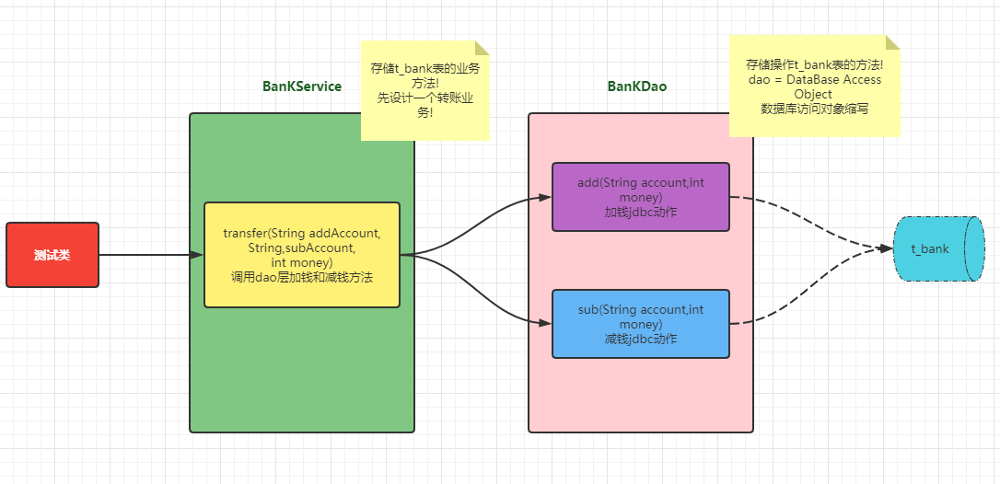
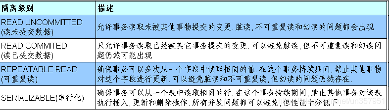

# 1. 数据库事务介绍
> 事务：一组逻辑操作单元，使数据从一种状态变换到另一种状态。

事务处理（事务操作）： 保证所有事务都作为一个工作单元来执行，即使出现了故障，都不能改变这种执行方式。当在一个事务中执行多个操作时，要么所有的事务都 **被提交(commit)**，那么这些修改就永久地保存下来；要么数据库管理系统将放弃所作的所有修改，整个事务 **回滚(rollback)** 到最初状态。

为确保数据库中数据的一致性，数据的操纵应当是离散的成组的逻辑单元：当它全部完成时，数据的一致性可以保持，而当这个单元中的一部分操作失败，整个事务应全部视为错误，所有从起始点以后的操作应全部回退到开始状态。

# 2. JDBC 事务处理
- 数据一旦提交，就不可回滚。

## 数据什么时候意味着提交？
- 当一个连接对象被创建时，默认情况下是自动提交事务：每次执行一个 SQL 语句时，如果执行成功，就会向数据库自动提交，而不能回滚。

- 关闭数据库连接，数据就会自动的提交。 如果多个操作，每个操作使用的是自己单独的连接，则无法保证事务。即同一个事务的多个操作必须在同一个连接下。

## JDBC 程序中为了让多个 SQL 语句作为一个事务执行：
- 调用 `Connection` 对象的 **setAutoCommit(false);** ——以取消自动提交事务

- 在所有的 SQL 语句都成功执行后，调用 `commit();` ——以提交事务

- 在出现异常时，调用 `rollback();` 方法回滚事务

- 若此时 `Connection` 没有被关闭，还可能被重复使用，则需要恢复其自动提交状态 `setAutoCommit(true)`

> 尤其是在使用数据库连接池技术时，执行 `close()` 方法前，建议恢复自动提交状态

## 那些操作会导致数据的自动提交？
1. DDL 操作一旦执行，都会自动提交
    - `set autocommit = false` 对 DDL 操作无效

2. DML 操作在默认情况下，一旦执行，就会自动提交
    - 可以通过 `set autocommit=false` 的方式取消 DML 操作的自动提交

3. 默认在关闭连接时，会自动的提交数据

# 3. 数据库事务使用的过程：
```java
@Test
public void testJDBCTransaction(){
    Connection conn = null;
    try{
        // 1、获取数据库的连接
        conn = JDBCUtils.getConnection();
        
        // 2、开启事务
        conn.setAutoCommit(false);
        
        // 3、进行数据库操作
        // ...
        
        // 4、如果没有异常，则提交事务
        conn.commit();
    }catch(Exception e){
        e.printStackTrace();
        // 5、如果有异常，则回滚事务
        try{
            conn.rollback();
        }catch(SQLException e1){
            e1.printStackTrace();
        }
    }finally{
        JDBCUtils.closeResource(conn, null);
    }
}
```

# 4. 案例：用户AA向用户BB转账100
### 数据库表数据
```sql
-- 继续在atguigu的库中创建银行表
CREATE TABLE t_bank(
   id INT PRIMARY KEY AUTO_INCREMENT COMMENT '账号主键',
   account VARCHAR(20) NOT NULL UNIQUE COMMENT '账号',
   money  INT UNSIGNED COMMENT '金额,不能为负值') ;

INSERT INTO t_bank(account,money) VALUES
  ('ergouzi',1000),('lvdandan',1000);
```

### 代码结构设计


```java
import java.sql.Connection;
import java.sql.PreparedStatement;
import java.sql.SQLException;

import org.junit.Test;

import utils.JDBCUtils;

public class JDBCTransaction {
	@Test
	public void testJDBCTransaction() {
		Connection conn = null;
		try {
			// 1.获取数据库连接
			conn = JDBCUtils.getConnection();
			
			// 2.开启事务
			conn.setAutoCommit(false);
			
			// 3.进行数据库操作
			String sql1 = "update t_bank set money = money + ? where account = ? ;";
			update(conn, sql1, 500, "ergouzi");

			// 模拟网络异常
			System.out.println(10 / 0);

			String sql2 = "update t_bank set money = money - ? where account = ? ;";
			update(conn, sql2, 500, "lvdandan");
			
			// 4.若没有异常，则提交事务
			conn.commit();
		} catch (Exception e) {
			e.printStackTrace();
			// 5.若有异常，则回滚事务
			try {
				conn.rollback();
			} catch (SQLException e1) {
				e1.printStackTrace();
			}
	    } finally {
	        try {
				//6.恢复每次 DML 操作的自动提交功能
				conn.setAutoCommit(true);
			} catch (SQLException e) {
				e.printStackTrace();
			}
	        //7.关闭连接
			JDBCUtils.closeResource(conn, null, null); 
	    }  
	}

	//使用事务以后的通用的增删改操作（version 2.0）
	public void update(Connection conn ,String sql, Object... args) {
		PreparedStatement ps = null;
		try {
			// 1.获取PreparedStatement的实例 (或：预编译sql语句)
			ps = conn.prepareStatement(sql);
			
			// 2.填充占位符
			for (int i = 0; i < args.length; i++) {
				ps.setObject(i + 1, args[i]);
			}
			
			// 3.执行sql语句
			ps.execute();
		} catch (Exception e) {
			e.printStackTrace();
		} finally {
			// 4.关闭资源
			JDBCUtils.closeResource(null, ps);
		}
	}
}
```

# 5. 事务的ACID属性
- **原子性（Atomicity）:** 原子性是指事务是一个不可分割的工作单位，事务中的操作要么都发生，要么都不发生。

- **一致性（Consistency）:** 事务必须使数据库从一个一致性状态变换到另外一个一致性状态。

- **隔离性（Isolation）:** 事务的隔离性是指一个事务的执行不能被其他事务干扰，即一个事务内部的操作及使用的数据对并发的其他事务是隔离的，并发执行的各个事务之间不能互相干扰。

- **持久性（Durability）:** 持久性是指一个事务一旦被提交，它对数据库中数据的改变就是永久性的，接下来的其他操作和数据库故障不应该对其有任何影响。

## 5.2 数据库的并发问题
> 对于同时运行的多个事务, 当这些事务访问数据库中相同的数据时, 如果没有采取必要的隔离机制, 就会导致各种并发问题:

- **脏读:** 对于两个事务 T1、T2，T1 读取了已经被 T2 更新但还没有被提交的字段。之后, 若 T2 回滚, T1读取的内容就是临时且无效的。

- **不可重复读:** 对于两个事务 T1、T2，T1 读取了一个字段, 然后 T2 更新了该字段。之后, T1再次读取同一个字段, 值就不同了。

- **幻读:** 对于两个事务 T1、T2，T1 从一个表中读取了一个字段, 然后 T2 在该表中插入了一些新的行。之后, 如果 T1 再次读取同一个表, 就会多出几行。

- 数据库事务的隔离性：数据库系统必须具有隔离并发运行各个事务的能力, 使它们不会相互影响, 避免各种并发问题。

- 一个事务与其他事务隔离的程度称为隔离级别。数据库规定了多种事务隔离级别, 不同隔离级别对应不同的干扰程度, 隔离级别越高, 数据一致性就越好, 但并发性越弱。

## 5.3 四种隔离级别
数据库提供的4种事务隔离级别：




- Oracle 支持的 2 种事务隔离级别：READ COMMITED, SERIALIZABLE。 Oracle 默认的事务隔离级别为: READ COMMITED 。

- Mysql 支持 4 种事务隔离级别。Mysql 默认的事务隔离级别为: REPEATABLE READ。

## 5.4 在 MySql 中设置隔离级别
> 每启动一个 mysql 程序, 就会获得一个单独的数据库连接. 每个数据库连接都有一个全局变量 `@@tx_isolation`, 表示当前的事务隔离级别。

### 查看当前的隔离级别:
```sql
SELECT @@tx_isolation;
```

### 设置当前 MySQL 连接的隔离级别:
```sql
set  transaction isolation level read committed;
```

### 设置数据库系统的全局的隔离级别:
```sql
set global transaction isolation level read committed;
```

### 创建 mysql 数据库用户：
```sql
create user tom identified by 'abc123';
```

### 授予权限
```sql
-- 授予通过网络方式登录的tom用户，对所有库所有表的全部权限，密码设为abc123.
grant all privileges on *.* to tom@'%'  identified by 'abc123'; 
```

```sql
-- 给tom用户使用本地命令行方式，授予 atguigudb 这个库下的所有表的插删改查的权限。
grant select,insert,delete,update on atguigudb.* to tom@localhost identified by 'abc123'; 
```