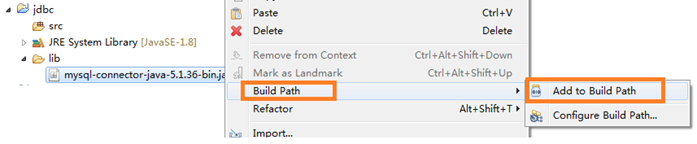
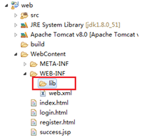
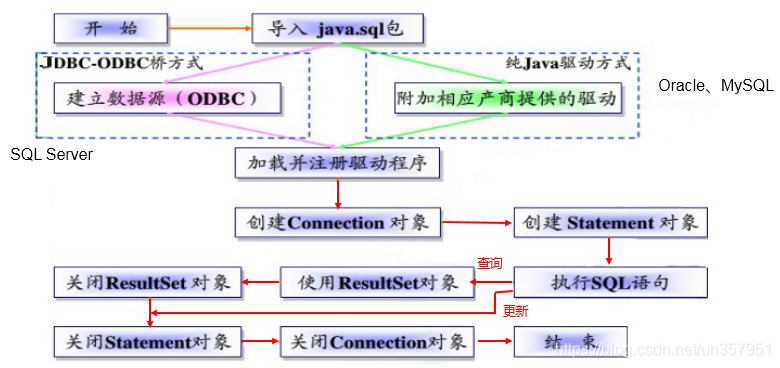

# 1. 引入 mysql-jdbc 驱动 (.jar檔)
## 1.1 驱动jar版本选择
我们选择版本 8.0.27版本

| mysql版本   | 推荐驱动版本 | 备注                                              |
| ----------- | ------------ | ------------------------------------------------- |
| mysql 5.5.x | 5.0.x        | com.mysql.jdbc.Driver                             |
| mysql 5.7.x | 5.1.x        | com.mysql.jdbc.Driver                             |
| msyql 8.x   | 8.0.x        | 建议: 8.0.25+省略时区设置com.mysql.cj.jdbc.Driver |

## 1.2 java工程导入依赖
1. **项目创建libs文件夹**
2. **导入驱动依赖jar包**
3. **jar包右键-添加为项目依赖**
   

> **注意：**
> - 如果是 Dynamic Web Project（动态的 web 项目）话，则是把驱动 jar 放到 WebContent（有的开发工具叫 WebRoot）目录中的 WEB-INF 目录中的 lib 目录下即可
> - 

# 2. jdbc基本使用步骤分析（6步）

1. 注册驱动
2. 获取连接
3. 创建发送sql语句对象
4. 发送sql语句，并获取返回结果
5. 结果集解析
6. 资源关闭

> **补充：ODBC(Open Database Connectivity，开放式数据库连接)**
> - 是微软在Windows平台下推出的。使用者在程序中只需要调用ODBC API，由 ODBC 驱动程序将调用转换成为对特定的数据库的调用请求。