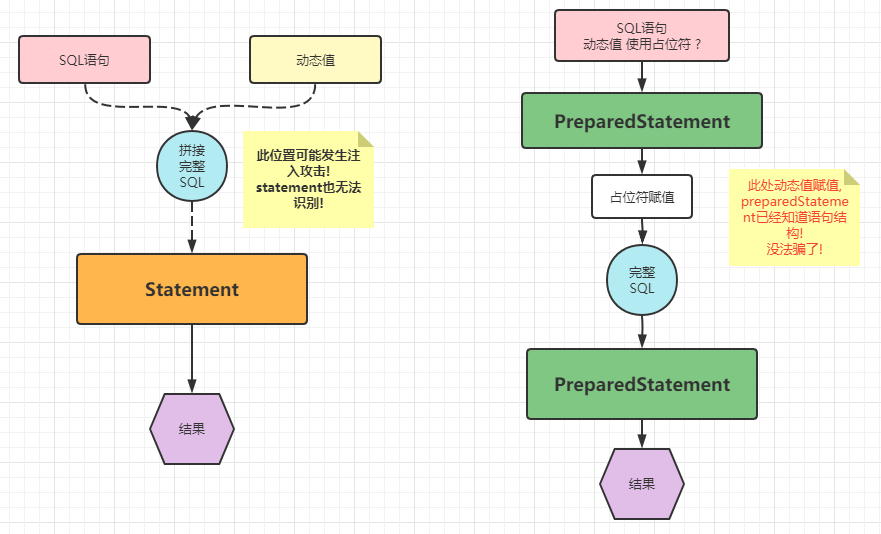
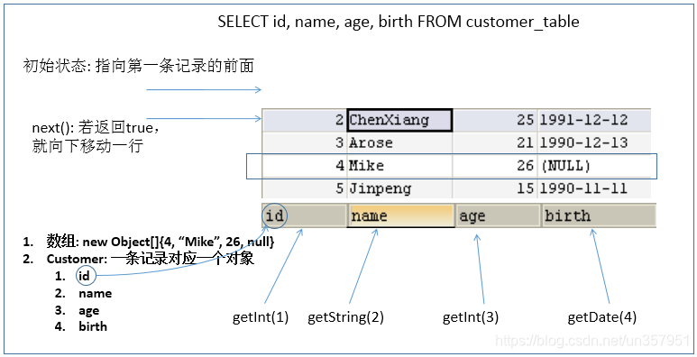
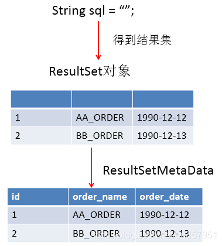
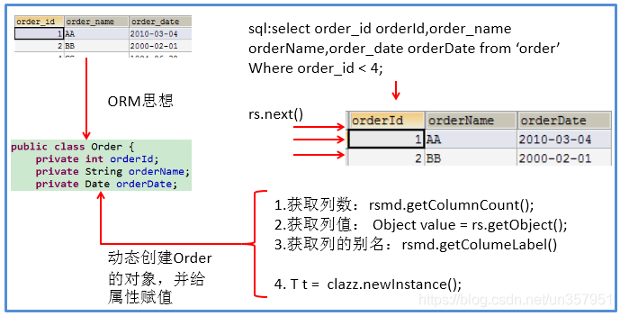

# 1 PreparedStatement 介绍
- 可以通过调用 **Connection** 对象的 `preparedStatement(String sql)` 方法获取 **PreparedStatement** 对象

- **PreparedStatement** 接口是 **Statement** 的子接口，它表示 `一条预编译过的 SQL 语句`

- **PreparedStatement** 对象所代表的 SQL 语句中的参数用问号 `?` 来表示，调用 **PreparedStatement** 对象的 `setXxx()` 方法来设置这些参数

- `setXxx()` 方法有两个参数，第一个参数是要设置的 SQL 语句中的参数的索引(从 1 开始)，第二个是设置的 SQL 语句中的参数的值

# 2 PreparedStatement vs Statement
- 代码的可读性和可维护性。
- **PreparedStatement** 能最大可能提高性能：
  - **DBServer** 会对预编译语句提供性能优化。因为预编译语句有可能被重复调用，所以语句在被 **DBServer** 的编译器编译后的执行代码被缓存下来，那么下次调用时只要是相同的预编译语句就不需要编译，只要将参数直接传入编译过的语句执行代码中就会得到执行。
  - 在 **statement** 语句中，即使是相同操作但因为数据内容不一样，所以整个语句本身不能匹配，没有缓存语句的意义。事实是没有数据库会对普通语句编译后的执行代码缓存。这样每执行一次都要对传入的语句编译一次。
- **PreparedStatement** 可以防止 SQL 注入，解決拼串問題。
    - 
- **PreparedStatement** 可以操作 Blob 的数据，而 Statement 做不到。
- **PreparedStatement** 可以实现更高效的批量操作。

##  `PreparedStatement` 是 `Statement` 的子接口
- 但 `PreparedStatement` 是 **預編譯 SQL**，SQL 語句是在建立 `PreparedStatement` 的時候就設定好的，**執行時不再傳入 SQL 字串**。

- `PreparedStatement` 中方法特點：
  - `executeUpdate()`：不需要傳 SQL 字串，直接執行
  - `executeQuery()`：不需要傳 SQL 字串，直接執行
  - `execute()`：不需要傳 SQL 字串，直接執行

  ```java
  PreparedStatement ps = conn.prepareStatement("SELECT * FROM users WHERE id = ?");
  ps.setInt(1, 1);
  ResultSet rs = ps.executeQuery(); // 這裡不需要再傳 SQL
  ```

# 3. ResultSet
- 查询需要调用 **PreparedStatement** 的 `executeQuery()` 方法，查询结果是一个 **ResultSet** 对象

- **ResultSet** 对象以逻辑表格的形式封装了执行数据库操作的结果集，**ResultSet** 接口由数据库厂商提供实现

- **ResultSet** 返回的实际上就是一张数据表。有一个指针指向数据表的第一条记录的前面。

- **ResultSet** 对象维护了一个指向当前数据行的游标，`初始的时候，游标在第一行之前`

- 可以通过 **ResultSet** 对象的 `next()` 方法移动到下一行。
  - 调用 `next()` 方法检测下一行是否有效。若有效，该方法返回 true，且指针下移。 相当于 **Iterator** 对象的 `hasNext()` 和 `next()` 方法的结合体。

- 当指针指向一行时，可以通过调用 `getXxx(int index)` 或 `getXxx(int columnName)` 获取每一列的值。
  - 例如 : `getInt(1)、getString("name")`



> 注意：Java与数据库交互涉及到的相关Java API中的索引都从1开始。

# 4. ResultSetMetaData
- 可用于获取关于 ResultSet 对象中列的类型和属性信息的对象
- `ResultSetMetaData meta = rs.getMetaData();`
  - `getColumnName(int column)`：获取指定列的 **名称**
  - `getColumnLabel(int column)`：获取指定列的 **别名**
  - `getColumnCount()`：返回当前 ResultSet 对象中的列数
  - `getColumnTypeName(int column)`：检索指定列的数据库特定的类型名称
  - `getColumnDisplaySize(int column)`：指示指定列的最大标准宽度，以字符为单位
  - `isNullable(int column)`：指示指定列中的值是否可以为 null
  - `isAutoIncrement(int column)`：指示是否自动为指定列进行编号，这样这些列仍然是只读的


## 4.2 针对于表的字段名与类的属性名不相同的情况 :
- 必须在声明 sql 时，使用类的属性名来命名字段的别名。

- 使用 ResultSetMetaata 时，需要使用 `getColumnLabel()` 来替换 `getcolumName()` 获取列的别名。

- 如果 sql 中没有给字段其名 `getColumnLabel()` 获取的就是列名

## 4.3 问题 1：得到结果集后，如何知道该结果集中有哪些列 ？ 列名是什么？
> 需要使用一个描述 ResultSet 的对象， 即 ResultSetMetaData



## 4.4 问题 2：关于 ResultSetMetaData


- 如何获取 ResultSetMetaData： 调用 ResultSet 的 `getMetaData()` 方法即可

- 获取 ResultSet 中有多少列：调用 ResultSetMetaData 的 `getColumnCount()` 方法

- 获取 ResultSet 每一列的列的别名是什么：调用 ResultSetMetaData 的`getColumnLabel()` 方法

# 5. 資源的釋放
- 释放 `ResultSet`、`Statement`、`Connection`。

- 数据库连接（Connection）是非常稀有的资源，用完后必须马上释放，如果 Connection 不能及时正确的关闭将导致系统宕机。Connection 的使用原则是尽量晚创建，尽量早的释放。

- 可以在 `finally` 中关闭，保证及时其他代码出现异常，资源也一定能被关闭。

# 6 Java 与 SQL 对应数据类型转换表

| Java 類型            | SQL 類型                           |
|---------------------|------------------------------------|
| boolean             | BIT                                 |
| byte                | TINYINT                             |
| short               | SMALLINT                            |
| int                 | INTEGER                             |
| long                | BIGINT                              |
| float               | REAL                                |
| double              | DOUBLE（或 MySQL 的 FLOAT）        |
| BigDecimal          | DECIMAL、NUMERIC                    |
| String              | CHAR、VARCHAR、LONGVARCHAR          |
| byte[]              | BINARY、VARBINARY、BLOB             |
| java.sql.Date       | DATE                                |
| java.sql.Time       | TIME                                |
| java.sql.Timestamp  | TIMESTAMP                           |
| java.util.Date      | DATE、TIMESTAMP（視轉換而定）       |
| LocalDate           | DATE                                |
| LocalTime           | TIME                                |
| LocalDateTime       | TIMESTAMP                           |
| Clob                | CLOB                                |
| Blob                | BLOB                                |

# 7. 基于 PreparedStatement 演示 CRUD
## 7.1 封裝數據庫連接和關閉操作
```java
package utils;

import java.io.InputStream;
import java.sql.Connection;
import java.sql.DriverManager;
import java.sql.ResultSet;
import java.sql.SQLException;
import java.sql.Statement;
import java.util.Properties;

public class JDBCUtils {
    public static Connection getConnection() throws Exception {
        // 1.读取配置文件中的4个基本信息
        InputStream is = ClassLoader.getSystemClassLoader().getResourceAsStream("jdbc.properties");

        Properties pros = new Properties();
        pros.load(is);

        String user = pros.getProperty("user");
        String password = pros.getProperty("password");
        String url = pros.getProperty("url");
        String driverClass = pros.getProperty("driverClass");

        // 2.加载驱动
        Class.forName(driverClass);

        // 3.获取连接
        Connection conn = DriverManager.getConnection(url, user, password);
        return conn;
    }

    public static void closeResource(Connection conn, Statement ps) {
        try {
            if (ps != null)
                ps.close();
        } catch (SQLException e) {
            e.printStackTrace();
        }

        try {
            if (conn != null)
                conn.close();
        } catch (SQLException e) {
            e.printStackTrace();
        }
    }
    
    // 關閉資源
    public static void closeResource(Connection conn, Statement ps, ResultSet rs) {
        try {
            if (ps != null)
                ps.close();
        } catch (SQLException e) {
            e.printStackTrace();
        }
        try {
            if (conn != null)
                conn.close();
        } catch (SQLException e) {
            e.printStackTrace();
        }
        try {
            if (rs != null)
                rs.close();
        } catch (SQLException e) {
            e.printStackTrace();
        }
    }
}
```

## 7.2 PreparedStatement 實現表數據的添加
```java
@Test
public void testInsert() {
    Connection conn = null;
    PreparedStatement ps = null;
    try {
        // 1.读取配置文件中的4个基本信息
        // getResourceAsStream(String str):获取类路径下的指定文件的输入流
        InputStream is = ClassLoader.getSystemClassLoader().getResourceAsStream("jdbc.properties");

        Properties pros = new Properties();
        pros.load(is);

        String user = pros.getProperty("user");
        String password = pros.getProperty("password");
        String url = pros.getProperty("url");
        String driverClass = pros.getProperty("driverClass");

        // 2.加载驱动
        Class.forName(driverClass);

        // 3.获取连接
        conn = DriverManager.getConnection(url, user, password);

        //4.预编译sql语句，返回PreparedStatement的实例
        String sql = "insert into customers(name, email, birth)values(?, ?, ?)";//?:占位符
        ps = conn.prepareStatement(sql);

        //5.填充占位符
        ps.setString(1, "哪吒");
        ps.setString(2, "nezha@gmail.com");
        SimpleDateFormat sdf = new SimpleDateFormat("yyyy-MM-dd");
        java.util.Date date = sdf.parse("1000-01-01");
        ps.setDate(3, new Date(date.getTime()));

        //6.执行操作
        ps.execute();
    } catch (Exception e) {
        e.printStackTrace();
    } finally {
        //7.资源的关闭
        try {
            if (ps != null)
                ps.close();
        } catch (SQLException e) {
            e.printStackTrace();
        }
        try {
            if (conn != null)
                conn.close();
        } catch (SQLException e) {
            e.printStackTrace();
        }
    }
}
```

## 7.3 PreparedStatement 實現表數據的修改操作
```java
@Test
public void testUpdate(){
    Connection conn = null;
    PreparedStatement ps = null;

    try {
        //1.获取数据库的连接
        conn = JDBCUtils.getConnection();

        //2.预编译sql语句，返回PreparedStatement的实例
        String sql = "update customers set name = ? where id = ?";
        ps = conn.prepareStatement(sql);

        //3.填充占位符
        ps.setObject(1, "莫扎特");
        ps.setObject(2, 20);

        //4.执行
        ps.execute();
    } catch (Exception e) {
        e.printStackTrace();
    }finally{
        //5.资源的关闭
        JDBCUtils.closeResource(conn, ps);
    }
}
```

## 7.4 PreparedStatement 實現表數據的刪除操作
```java
@Test
public void testDelete() {
    Connection conn = null;
    PreparedStatement ps = null;

    try {
        //1.获取数据库的连接
        conn = JDBCUtils.getConnection();

        //2.预编译sql语句，返回PreparedStatement的实例
        String sql = "DELETE FROM customers WHERE id = ?";
        ps = conn.prepareStatement(sql);

        //3.填充占位符
        ps.setObject(1, 20);

        //4.执行
        ps.execute();
    } catch (Exception e) {
        e.printStackTrace();
    } finally {
        //5.资源的关闭
        JDBCUtils.closeResource(conn, ps);
    }
}
```

## 7.5 使用 PreparedStatement 实现查询操作
> 對於查詢來說會返回結果集，對於 Java來說萬事萬物皆對象，所以這個結果集必須拿一個類來充當。

> **ORM 编程思想（object relational mapping）**
> - 一个数据表对应一个 java 类
> - 表中的一条记录对应 java 类的一个对象
> - 表中的一个字段对应 java 类的一个属性

### 7.5.1 針對 customers 表的查詢操作
#### 測試代碼 :

```java
package preparedstatement;

import org.junit.Test;

import java.sql.Connection;
import java.sql.Date;
import java.sql.PreparedStatement;
import java.sql.ResultSet;

public class PreparedStatementQueryTest {
    @Test
    public void testQuery1() {
        Connection conn = null;
        PreparedStatement ps = null;
        ResultSet resultSet = null;
        try {
            //1. 獲取連接
            conn = JDBCUtils.getConnection();

            //2. 獲取預編譯 sql 語句
            String sql = "select id,name,email,birth from customers where id = ?";
            ps = conn.prepareStatement(sql);

            //3. 填充佔位符
            ps.setObject(1, 1);

            //4. 执行,并返回结果集
            resultSet = ps.executeQuery();

            //5. 处理结果集
            //next():判断结果集的下一条是否有数据，如果有数据返回true并指针下移；如果返回false指针不会下移。
            if (resultSet.next()) {
                //获取当前这条数据的各个字段值
                int id = resultSet.getInt(1);
                String name = resultSet.getString(2);
                String email = resultSet.getString(3);
                Date birth = resultSet.getDate(4);

                //方式三：将数据封装为一个对象（推荐）
                Customer customer = new Customer(id, name, email, birth);
                System.out.println(customer);
            }
        } catch (Exception e) {
            e.printStackTrace();
        } finally {
            //ˊ6. 关闭资源
            JDBCUtils.closeResource(conn, ps, resultSet);
        }
    }
}
```

#### Customer 類
```java
package preparedstatement;


import java.util.Date;

public class Customer {

    private int id;
    private String name;
    private String email;
    private Date birth;

    public Customer() {
        super();
    }

    public Customer(int id, String name, String email, Date birth) {
        super();
        this.id = id;
        this.name = name;
        this.email = email;
        this.birth = birth;
    }

    public int getId() {
        return id;
    }

    public void setId(int id) {
        this.id = id;
    }

    public String getName() {
        return name;
    }

    public void setName(String name) {
        this.name = name;
    }

    public String getEmail() {
        return email;
    }

    public void setEmail(String email) {
        this.email = email;
    }

    public Date getBirth() {
        return birth;
    }

    public void setBirth(Date birth) {
        this.birth = birth;
    }

    @Override
    public String toString() {
        return "Customer [id=" + id + ", name=" + name + ", email=" + email + ", birth=" + birth + "]";
    }
}
```


### 7.5.2 針對 order 表的查詢操作
#### 測試代碼:

```java
package preparedstatement;

import org.junit.Test;

import java.sql.Connection;
import java.sql.PreparedStatement;
import java.sql.ResultSet;
import java.util.Date;

public class OrderForQuery {
    @Test
    public void testQuery1() {

        Connection conn = null;
        PreparedStatement ps = null;
        ResultSet rs = null;

        try {
            conn = JDBCUtils.getConnection();

            String sql = "select order_id, order_name, order_date from `order` where order_id = ?";

            ps = conn.prepareStatement(sql);
            ps.setObject(1, 1);

            rs = ps.executeQuery();

            if (rs.next()) {
                int id = (int) rs.getObject(1);
                String name = (String) rs.getObject(2);
                Date date = rs.getObject(3, Date.class);

                Order order = new Order(id, name, date);
                System.out.println(order);
            }
        } catch (Exception e) {
            e.printStackTrace();
        } finally {

            JDBCUtils.closeResource(conn, ps, rs);
        }
    }
}
```

#### Order 類
```java
package preparedstatement;

import java.util.Date;

public class Order {
    private int orderId;
    private String orderName;
    private Date orderDate;

    public Order() {
        super();
    }

    public Order(int orderId, String orderName, Date orderDate) {
        super();
        this.orderId = orderId;
        this.orderName = orderName;
        this.orderDate = orderDate;
    }

    public int getOrderId() {
        return orderId;
    }

    public void setOrderId(int orderId) {
        this.orderId = orderId;
    }

    public String getOrderName() {
        return orderName;
    }

    public void setOrderName(String orderName) {
        this.orderName = orderName;
    }

    public Date getOrderDate() {
        return orderDate;
    }

    public void setOrderDate(Date orderDate) {
        this.orderDate = orderDate;
    }

    @Override
    public String toString() {
        return "Order [orderId=" + orderId + ", orderName=" + orderName + ", orderDate=" + orderDate + "]";
    }
}
```

## 7.6 實現通用的增刪改操作
> **通用的增刪改操作:**
> 1. 獲取連接
> 2. 獲取預編譯 sql 語句
> 3. 填充佔位符
> 4. 執行 sql 語句
> 5. 關閉資源

```java
package preparedstatement;

import org.junit.Test;

import java.sql.Connection;
import java.sql.PreparedStatement;

public class PreparedStatementCommonUpdate {
    @Test
    public void testCommonUpdate() {
        String sql = "update `order` set order_name = ? where order_id = ?";
        update(sql, "DD", "2");
    }

    //通用的增删改操作
    public void update(String sql, Object... args) { //sql中占位符的个数与可变形参的长度相同！
        Connection conn = null;
        PreparedStatement ps = null;

        try {
            //1.获取数据库的连接
            conn = JDBCUtils.getConnection();

            //2.预编译sql语句，返回PreparedStatement的实例
            ps = conn.prepareStatement(sql);

            //3.填充占位符
            for (int i = 0; i < args.length; i++) {
                ps.setObject(i + 1, args[i]); //小心参数声明错误！！
            }

            //4.执行
            ps.execute();
        } catch (Exception e) {
            e.printStackTrace();
        } finally {
            //5.资源的关闭
            JDBCUtils.closeResource(conn, ps);
        }
    }
}
```

## 7.7 針對 customers 表的通用查詢操作
```java
import org.junit.Test;

import bean.Customer;
import utils.JDBCUtils;

import java.lang.reflect.Field;
import java.sql.Connection;
import java.sql.PreparedStatement;
import java.sql.ResultSet;
import java.sql.ResultSetMetaData;

public class CustomerForQuery {
    @Test
    public void testQueryForCustomers() {
        String sql = "SELECT `name`, birth FROM customers WHERE `name` = ?;";
        Customer customer = queryForCustomers(sql, "林志玲");
        System.out.println(customer);
    }
    
    public Customer queryForCustomers(String sql, Object... args) {
        Connection conn = null;
        PreparedStatement ps = null;
        ResultSet rs = null;

        try {
            //1. 獲取連接
            conn = JDBCUtils.getConnection();

            //2. 獲取預編譯 sql 語句
            ps = conn.prepareStatement(sql);

            //3. 填充佔位符
            for (int i = 0; i < args.length; i++) {
                ps.setObject(i + 1, args[i]);
            }

            //4. 執行語句
            rs = ps.executeQuery();

            //获取结果集的元数据 :ResultSetMetaData
            ResultSetMetaData rsmd = rs.getMetaData();

            //通过ResultSetMetaData获取结果集中的列数
            int columnCount = rsmd.getColumnCount();

            if (rs.next()) {
                Customer cust = new Customer();

                //处理结果集一行数据中的每一个列
                for (int i = 0; i < columnCount; i++) {
                    //获取列值
                    Object columValue = rs.getObject(i + 1);

                    //获取每个列的列名
//					String columnName = rsmd.getColumnName(i + 1);
                    String columnLabel = rsmd.getColumnLabel(i + 1);

                    //给cust对象指定的columnName属性，赋值为columValue：通过反射
                    Field field = Customer.class.getDeclaredField(columnLabel);
                    field.setAccessible(true); //確保能夠訪問
                    field.set(cust, columValue);
                }

                return cust;
            }
        } catch (Exception e) {
            e.printStackTrace();
        } finally {
            JDBCUtils.closeResource(conn, ps, rs);
        }

        return null;
    }
}
```

## 7.8 針對 order 表的通用查詢操作
> 我們數據庫設計的欄位名是 `order_id、order_name、order_date`，而我們的 Order 類的屬性名是 `orderId、orderName、orderDate` 現在我們是拿到欄位名加上利用反射機制去創建物件，但是現在就會有欄位名稱和屬性名不一致的問題。

- 當列名和屬性名不一致時，可以替列名取別名，此時我們就可以使用 `getColumnLabel()` 方法获取列的列名：
  - `getColumnName()`  → 不推荐使用，获取列的别名
  - `getColumnLabel()`  →  推薦，如果沒有別名獲取到的就是列名

- 针对于表的字段名与类的属性名不相同的情况：
  - 声明 sql 时，使用类的属性名来命名字段的别名
  - 使用 ResultSetMetaData 时，需要使用 getColumnLabel() 来替换 getColumnName() 获取列的别名
  - **如果 sql 中没有给字段其别名，getColumnLabel() 获取的就是列名**

#### 代碼 :
```java
import java.lang.reflect.Field;
import java.sql.Connection;
import java.sql.PreparedStatement;
import java.sql.ResultSet;
import java.sql.ResultSetMetaData;

import org.junit.Test;

import bean.Order;
import utils.JDBCUtils;

public class OrderForQuery2 {
	@Test
	public void testQuery2() {
	    String sql = "select order_id orderId, order_name orderName, order_date orderDate from `order` where order_id = ?";
	    Order order = orderForQuery(sql, 1);
	    System.out.println(order);
	}
	
	public Order orderForQuery(String sql, Object... args) {
	    Connection conn = null;
	    PreparedStatement ps = null;
	    ResultSet rs = null;

	    try {
	        conn = JDBCUtils.getConnection();

	        ps = conn.prepareStatement(sql);
	        for (int i = 0; i < args.length; i++) {
	            ps.setObject(i + 1, args[i]);
	        }

	        //执行，获取结果集
	        rs = ps.executeQuery();

	        //获取结果集的元数据
	        ResultSetMetaData rsmd = rs.getMetaData();

	        //获取列数
	        int columnCount = rsmd.getColumnCount();

	        if (rs.next()) {
	            Order order = new Order();
	            for (int i = 0; i < columnCount; i++) {
	                //获取每个列的列值:通过ResultSet
	                Object columnValue = rs.getObject(i + 1);
	                //通过ResultSetMetaData
	                //获取列的列名：getColumnName() --不推荐使用
	                //获取列的别名：getColumnLabel()
	                //String columnName = rsmd.getColumnName(i + 1);
	                String columnLabel = rsmd.getColumnLabel(i + 1);

	                //通过反射，将对象指定名columnName的属性赋值为指定的值columnValue
	                Field field = Order.class.getDeclaredField(columnLabel);
	                field.setAccessible(true);
	                field.set(order, columnValue);
	            }

	            return order;
	        }
	    } catch (Exception e) {
	        e.printStackTrace();
	    } finally {

	        JDBCUtils.closeResource(conn, ps, rs);
	    }
	    return null;
	}
}
```