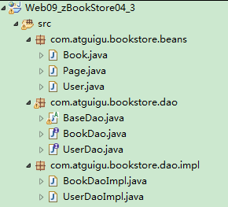
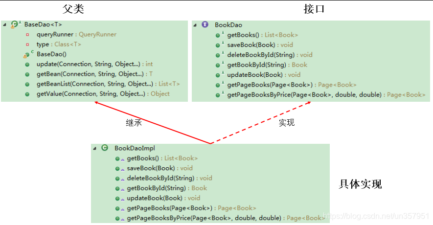

# 1. 概述
- DAO：Data Access Object 访问数据信息的类和接口，包括了对数据的 CRUD（Create、Retrival、Update、 Delete），而不包含任何业务相关的信息。有时也称作：BaseDAO
- 作用：为了实现功能的模块化，更有利于代码的维护和升级。
- 下面是尚硅谷 JavaWeb 阶段书城项目中 DAO 使用的体现：
  - 
- 层次结构：
  - 

# 2. 提供操作數據表的 BaseDao
- 我們很有可能有多條增刪改語句，我們必須保證他們都是同一個事務，所以我們連接是設計成參數的形式。

- 注意連接不要在 `update()`、`getInstance()`、`getForList()` 關閉，你在哪裡創建連接的就在那裏關閉，這樣才能確保連接物件是同一個。

## 通用的增删改操作 :

```java
// 通用的增删改操作---version 2.0 （考虑上事务）
public int update(Connection conn, String sql, Object... args) {// sql中占位符的个数与可变形参的长度相同！
    PreparedStatement ps = null;
    try {
        // 1.预编译sql语句，返回PreparedStatement的实例
        ps = conn.prepareStatement(sql);

        // 2.填充占位符
        for (int i = 0; i < args.length; i++) {
            ps.setObject(i + 1, args[i]);// 小心参数声明错误！！
        }

        // 3.执行
        return ps.executeUpdate();
    } catch (Exception e) {
        throw new RuntimeException(e); // ✅ 讓上層感知錯誤
    } finally {
        // 4.资源的关闭
        JDBCUtils.closeResource(null, ps); // 注意這裡只關 ps，不關 conn
    }
}
```

## 通用的查询操作，用于返回数据表中的多条记录构成的集合 :

```java
// 通用的查询操作，用于返回数据表中的多条记录构成的集合（version 2.0：考虑上事务）
public <T> List<T> getForList(Connection conn, Class<T> clazz, String sql, Object... args) {
    PreparedStatement ps = null;
    ResultSet rs = null;

    try {
        ps = conn.prepareStatement(sql);
        for (int i = 0; i < args.length; i++) {
            ps.setObject(i + 1, args[i]);
        }

        rs = ps.executeQuery();
        // 获取结果集的元数据 :ResultSetMetaData
        ResultSetMetaData rsmd = rs.getMetaData();
        // 通过ResultSetMetaData获取结果集中的列数
        int columnCount = rsmd.getColumnCount();
        // 创建集合对象
        List<T> list = new ArrayList<T>();

        while (rs.next()) {
            T t = clazz.newInstance();

            // 处理结果集一行数据中的每一个列:给t对象指定的属性赋值
            for (int i = 0; i < columnCount; i++) {
                // 获取列值
                Object columValue = rs.getObject(i + 1);

                // 获取每个列的列名
                String columnLabel = rsmd.getColumnLabel(i + 1);

                // 给t对象指定的columnName属性，赋值为columValue：通过反射
                Field field = clazz.getDeclaredField(columnLabel);
                field.setAccessible(true);
                field.set(t, columValue);
            }
            list.add(t);
        }
        return list;
    } catch (Exception e) {
        throw new RuntimeException(e); // ✅ 讓上層感知錯誤
    } finally {
        JDBCUtils.closeResource(null, ps, rs);
    }
}
```

## 通用的查询操作，用于返回数据表中的一条记录 :

```java
// 通用的查询操作，用于返回数据表中的一条记录（version 2.0：考虑上事务）
public <T> T getInstance(Connection conn, Class<T> clazz, String sql, Object... args) {
    PreparedStatement ps = null;
    ResultSet rs = null;

    try {
        ps = conn.prepareStatement(sql);
        for (int i = 0; i < args.length; i++) {
            ps.setObject(i + 1, args[i]);
        }

        rs = ps.executeQuery();
        // 获取结果集的元数据 :ResultSetMetaData
        ResultSetMetaData rsmd = rs.getMetaData();
        // 通过ResultSetMetaData获取结果集中的列数
        int columnCount = rsmd.getColumnCount();

        if (rs.next()) {
            T t = clazz.newInstance();

            // 处理结果集一行数据中的每一个列
            for (int i = 0; i < columnCount; i++) {
                // 获取列值
                Object columValue = rs.getObject(i + 1);

                // 获取每个列的列名
                // String columnName = rsmd.getColumnName(i + 1);
                String columnLabel = rsmd.getColumnLabel(i + 1);

                // 给t对象指定的columnName属性，赋值为columValue：通过反射
                Field field = clazz.getDeclaredField(columnLabel);
                field.setAccessible(true);
                field.set(t, columValue);
            }

            return t;
        }
    } catch (Exception e) {
        throw new RuntimeException(e);  // ✅ 讓上層感知錯誤
    } finally {
        JDBCUtils.closeResource(null, ps, rs);
    }

    return null;  // 查無資料返回 null
}
```

## 用于查询特殊值的通用的方法 :

```java
//用于查询特殊值的通用的方法
public <E> E getValue(Connection conn,  Class<E> clazz, String sql, Object... args) {
    PreparedStatement ps = null;
    ResultSet rs = null;

    try {
        ps = conn.prepareStatement(sql);
        for (int i = 0; i < args.length; i++) {
            ps.setObject(i + 1, args[i]);
        }

        rs = ps.executeQuery();

        if (rs.next()) {
            // 轉型成我們需要返回的類型
            return clazz.cast(rs.getObject(1));
        }
    } catch (SQLException e) {
         throw new RuntimeException(e);  // ✅ 讓上層感知錯誤
    } finally {
        JDBCUtils.closeResource(null, ps, rs);
    }
    return null;
}
```

# 3. JDBCUtils 使用數據連接池獲取連接
## 3.1 配置文件
```properties
url=jdbc:mysql:///test
username=root
password=root
driverClassName=com.mysql.cj.jdbc.Driver

initialSize=10
maxActive=10
```
## 工具類代碼

```java
import com.alibaba.druid.pool.DruidDataSourceFactory;

import javax.sql.DataSource;
import java.io.InputStream;
import java.sql.Connection;
import java.sql.ResultSet;
import java.sql.SQLException;
import java.sql.Statement;
import java.util.Properties;

public class JDBCUtils {
    // 創建連接池引用，因為要提供給當前項目的全局使用，所以創建為靜態的。
    public static DataSource dataSource; // 確保連接池只會有一個

    // 在項目啟動時，即創建連接池對象，賦值給 dataSource
    static { //靜態代碼塊只會加載一次, 也就讓以下操作只會執行一次
        try {
            Properties pros = new Properties();

            InputStream is = JDBCUtils.class.getClassLoader().getResourceAsStream("druid.properties");

            pros.load(is);

            dataSource = DruidDataSourceFactory.createDataSource(pros);
        } catch (Exception e) {
            throw new RuntimeException(e);
        }
    }

    public static Connection getConnection() {
        try {
            return dataSource.getConnection();
        } catch (SQLException e) {
            throw new RuntimeException(e);
        }
    }

    // 關閉資源
    public static void closeResource(Connection conn, Statement ps, ResultSet rs) {
        try {
            if (ps != null)
                ps.close();
        } catch (SQLException e) {
            e.printStackTrace();
        }
        try {
            if (conn != null)
                conn.close();
        } catch (SQLException e) {
            e.printStackTrace();
        }
        try {
            if (rs != null)
                rs.close();
        } catch (SQLException e) {
            e.printStackTrace();
        }
    }
}
```

# 4. JDBCUtils 使用 ThreadLocal 解決多線程併發問題
> JDK1.2 的版本中就提供 `java.lang.hreadLocal`，为解决多线程程序的并发问题提供了一种新的思路。使用这个工具类可以很简洁地编写出优美的多线程程序通常用来在在多线程中管理共享数据库连接、Session等。

- **ThreadLocal** 用于保存某个线程共享变量，原因是在 Java 中，每一个线程对象中都有一个 `ThreadLocalMap<ThreadLocal, Object>`，其 key 就是一个 **ThreadLocal**，而 Object 即为该线程的共享变量。

- 而这个 map 是通过 ThreadLocal 的 set 和 get 方法操作的。对于同一个 static ThreadLocal，不同线程只能从中get、set、remove自己的变量，而不会影响其他线程的变量。
  - 在进行对象跨层传递的时候，使用 ThreadLocal 可以避免多次传递，打破层次间的约东。
  - 线程间数据隔离。
  - 进行事务操作，用于存储线程事务信息。
  - 数据库连接、Session会话管理

1、**ThreadLocal对象.get :** 获取 ThreadLocal 中当前线程共享变量的值。

2、**ThreadLocal对象.set :** 设置 ThreadLocal 中当前线程共享变量的值。

3、**ThreadLocal对象.remove :** 移除 ThreadLocal 中当前线程共享变量的值。

- 維護一個連接池對象、維護一個線程綁定變量的 ThreadLocal 對象。
- 對外提供在 ThreadLocal 中獲取連接的方法。
- 對外提供回收連接的方法，回收過程中，將要回收的連接從 ThreadLocal 中移除。

> - 注意 : 工具類僅對外提供共性的功能代碼，所以方法均為靜態方法
>
> - 注意 : 使用 ThreadLocal 就是為了一個線程在多次數據庫操作過程中，使用的是同一個連接。

## 4.1 配置文件
```properties
url=jdbc:mysql:///test
username=root
password=root
driverClassName=com.mysql.cj.jdbc.Driver

initialSize=10
maxActive=10
```

## 4.2 工具類代碼
```java
import com.alibaba.druid.pool.DruidDataSourceFactory;

import javax.sql.DataSource;
import java.io.InputStream;
import java.sql.Connection;
import java.sql.ResultSet;
import java.sql.SQLException;
import java.sql.Statement;
import java.util.Properties;

public class JDBCUtilsV2 {
    // 創建連接池引用，因為要提供給當前項目的全局使用，所以創建為靜態的。
    public static DataSource dataSource; // 確保連接池只會有一個
    public static ThreadLocal<Connection> threadLocal = new ThreadLocal<>();

    // 在項目啟動時，即創建連接池對象，賦值給 dataSource
    static { //靜態代碼塊只會加載一次, 也就讓以下操作只會執行一次
        try {
            Properties pros = new Properties();

            InputStream is = JDBCUtilsV2.class.getClassLoader().getResourceAsStream("druid.properties");

            pros.load(is);

            dataSource = DruidDataSourceFactory.createDataSource(pros);
        } catch (Exception e) {
            throw new RuntimeException(e);
        }
    }

    public static Connection getConnection() {
        try {
            //在threadLocal中獲取連接
            Connection connection = threadLocal.get();

            //threadLocal裡沒有存儲連接，也就是第一次獲取
            if (connection == null) {
                //在連接池中獲取一個連接，存儲在threadLocal裡
                connection = dataSource.getConnection();
                threadLocal.set(connection);
            }

            return connection;
        } catch (SQLException e) {
            throw new RuntimeException(e);
        }
    }


    // 關閉資源
    public static void closeResource(Connection conn, Statement ps, ResultSet rs) {
        try {
            if (ps != null)
                ps.close();
        } catch (SQLException e) {
            throw new RuntimeException(e);
        }
        try {
            if (rs != null)
                rs.close();
        } catch (SQLException e) {
            throw new RuntimeException(e);
        }
        try {
            if (conn != null) {
                //從theadLocal中移除當前已經存儲的Connection對象
                threadLocal.remove();
                //將Connection歸還給連接池
                conn.close();
            }
        } catch (SQLException e) {
            throw new RuntimeException(e);
        }
    }
}
```

## 4.3 測試

```java
@Test
public void test01() throws SQLException {
    Connection connection1 = JDBCUtils.getConnection();
    Connection connection2 = JDBCUtils.getConnection();
    Connection connection3 = JDBCUtils.getConnection();

    System.out.println(connection1);
    System.out.println(connection2);
    System.out.println(connection3);
}

@Test
public void test02() throws SQLException {
    Connection connection1 = JDBCUtilsV2.getConnection();
    Connection connection2 = JDBCUtilsV2.getConnection();
    Connection connection3 = JDBCUtilsV2.getConnection();

    System.out.println(connection1);
    System.out.println(connection2);
    System.out.println(connection3);
}
```


# 5. CustomerDao 和 CustomerDaoImpl 的實現

## **接口實現類 :**

```java
import java.sql.Connection;
import java.sql.Date;
import java.util.List;

public class CustomerDAOImpl extends BaseDAO implements CustomerDAO {
    @Override
    public void insert(Connection conn, Customer cust) {
        String sql = "insert into customers(name, email, birth) values(?, ?, ?)";
        update(conn, sql, cust.getName(), cust.getEmail(), cust.getBirth());
    }

    @Override
    public void deleteById(Connection conn, int id) {
        String sql = "delete from customers where id = ?";
        update(conn, sql, id);
    }

    @Override
    public void update(Connection conn, Customer cust) {
        String sql = "update customers set name = ?,email = ?,birth = ? where id = ?";
        update(conn, sql, cust.getName(), cust.getEmail(), cust.getBirth(), cust.getId());
    }

    @Override
    public Customer getCustomerById(Connection conn, int id) {
        String sql = "select id,name,email,birth from customers where id = ?";
        Customer customer = getInstance(conn, Customer.class, sql, id);
        return customer;
    }

    @Override
    public List<Customer> getAll(Connection conn) {
        String sql = "select id,name,email,birth from customers";
        List<Customer> list = getForList(conn, Customer.class, sql);
        return list;
    }

    @Override
    public Long getCount(Connection conn) {
        String sql = "select count(*) from customers";
        return getValue(conn, Long.class, sql);
    }

    @Override
    public Date getMaxBirth(Connection conn) {
        String sql = "select max(birth) from customers";
        return getValue(conn, Date.class, sql);
    }
}
```

## **接口 :**

```java
import java.sql.Connection;
import java.sql.Date;
import java.util.List;

/*
 * 此接口用于规范针对于customers表的常用操作
 */
public interface CustomerDAO {

    // 将cust对象添加到数据库中
    void insert(Connection conn, Customer cust);

    // 针对指定的id，删除表中的一条记录
    void deleteById(Connection conn, int id);

    // 针对内存中的cust对象，去修改数据表中指定的记录
    void update(Connection conn, Customer cust);

    // 针对指定的id查询得到对应的Customer对象
    Customer getCustomerById(Connection conn, int id);

    // 查询表中的所有记录构成的集合
    List<Customer> getAll(Connection conn);

    // 返回数据表中的数据的条目数
    Long getCount(Connection conn);

    // 返回数据表中最大的生日
    Date getMaxBirth(Connection conn);
}
```

## **Customer 類 :**

```java
import java.sql.Date;

public class Customer {
    private int id;
    private String name;
    private String email;
    private Date birth;

    public Customer() {
        super();
    }

    public Customer(int id, String name, String email, Date birth) {
        super();
        this.id = id;
        this.name = name;
        this.email = email;
        this.birth = birth;
    }

    public int getId() {
        return id;
    }

    public void setId(int id) {
        this.id = id;
    }

    public String getName() {
        return name;
    }

    public void setName(String name) {
        this.name = name;
    }

    public String getEmail() {
        return email;
    }

    public void setEmail(String email) {
        this.email = email;
    }

    public Date getBirth() {
        return birth;
    }

    public void setBirth(Date birth) {
        this.birth = birth;
    }

    @Override
    public String toString() {
        return "Customer [id=" + id + ", name=" + name + ", email=" + email + ", birth=" + birth + "]";
    }
}
```

## 測試 

```java
import org.junit.Test;

import bean.Customer;

import java.sql.Connection;
import java.sql.Date;
import java.sql.SQLException;
import java.util.List;

public class CustomerDAOImplTest {
    private CustomerDAOImpl dao = new CustomerDAOImpl();
    @Test
    public void testInsert() {
        Connection conn = null;
        try {
            conn = JDBCUtilsV2.getConnection();
            conn.setAutoCommit(false); // 開啟手動事務
            
            Customer cust = new Customer(1, "于小飞", "xiaofei@126.com", new Date(43534646435L));
            dao.insert(conn, cust);
            
            conn.commit(); // 正常就提交
            System.out.println("添加成功");
        } catch (Exception e) {
        	if (conn != null) {
              try {
                  conn.rollback(); // 發生異常就回滾
              } catch (SQLException ex) {
                  ex.printStackTrace();
              }
        	}
            e.printStackTrace();
        }finally{
            JDBCUtilsV2.closeResource(conn, null, null);
        }
    }

    @Test
    public void testDeleteById() {
        Connection conn = null;
        try {
            conn = JDBCUtilsV2.getConnection();
            conn.setAutoCommit(false); // 開啟手動事務

            dao.deleteById(conn, 31);

            conn.commit(); // 正常就提交
            System.out.println("删除成功");
        } catch (Exception e) {
        	if (conn != null) {
                try {
                    conn.rollback(); // 發生異常就回滾
                } catch (SQLException ex) {
                    ex.printStackTrace();
                }
          	}
            e.printStackTrace();
        }finally{
            JDBCUtilsV2.closeResource(conn, null, null);
        }
    }

    @Test
    public void testUpdateConnectionCustomer() {
        Connection conn = null;
        try {
            conn = JDBCUtilsV2.getConnection();
            conn.setAutoCommit(false); // 開啟手動事務
            
            Customer cust = new Customer(32,"贝多芬","beiduofen@126.com",new Date(453465656L));
            dao.update(conn, cust);

            conn.commit(); // 正常就提交
            System.out.println("修改成功");
        } catch (Exception e) {
        	if (conn != null) {
                try {
                    conn.rollback(); // 發生異常就回滾
                } catch (SQLException ex) {
                    ex.printStackTrace();
                }
          	}
            e.printStackTrace();
        }finally{
            JDBCUtilsV2.closeResource(conn, null, null);
        }
    }

    @Test
    public void testGetCustomerById() {
        Connection conn = null;
        try {
            conn = JDBCUtilsV2.getConnection();
            conn.setAutoCommit(false); // 開啟手動事務

            Customer cust = dao.getCustomerById(conn, 10);
            
            conn.commit(); // 正常就提交
            System.out.println(cust);
        } catch (Exception e) {
        	if (conn != null) {
                try {
                    conn.rollback(); // 發生異常就回滾
                } catch (SQLException ex) {
                    ex.printStackTrace();
                }
          	}
            e.printStackTrace();
        }finally{
            JDBCUtilsV2.closeResource(conn, null, null);
        }
    }

    @Test
    public void testGetAll() {
        Connection conn = null;
        try {
            conn = JDBCUtilsV2.getConnection();
            conn.setAutoCommit(false); // 開啟手動事務

            List<Customer> list = dao.getAll(conn);
            list.forEach(System.out::println);

            conn.commit(); // 正常就提交
        } catch (Exception e) {
        	if (conn != null) {
                try {
                    conn.rollback(); // 發生異常就回滾
                } catch (SQLException ex) {
                    ex.printStackTrace();
                }
          	}
            e.printStackTrace();
        }finally{
            JDBCUtilsV2.closeResource(conn, null, null);
        }
    }

    @Test
    public void testGetCount() {
        Connection conn = null;
        try {
            conn = JDBCUtilsV2.getConnection();
            conn.setAutoCommit(false); // 開啟手動事務

            Long count = dao.getCount(conn);

            conn.commit(); // 正常就提交
            System.out.println("表中的记录数为：" + count);
        } catch (Exception e) {
        	if (conn != null) {
                try {
                    conn.rollback(); // 發生異常就回滾
                } catch (SQLException ex) {
                    ex.printStackTrace();
                }
          	}
            e.printStackTrace();
        }finally{
            JDBCUtilsV2.closeResource(conn, null, null);
        }
    }

    @Test
    public void testGetMaxBirth() {
        Connection conn = null;
        try {
            conn = JDBCUtilsV2.getConnection();
            conn.setAutoCommit(false); // 開啟手動事務

            Date maxBirth = dao.getMaxBirth(conn);

            conn.commit(); // 正常就提交
            System.out.println("最大的生日为：" + maxBirth);
        } catch (Exception e) {
        	if (conn != null) {
                try {
                    conn.rollback(); // 發生異常就回滾
                } catch (SQLException ex) {
                    ex.printStackTrace();
                }
          	}
            e.printStackTrace();
        }finally{
            JDBCUtilsV2.closeResource(conn, null, null);
        }
    }
}
```

# 6. 升級以後的 Dao 及相關類的測試
- 未升級的版本缺點 :
  - 因為 CustomerDaoImpl 就是操作 Customer 這張表的，那我們就想不需要傳入 Customer.class 作為參數，因為我們也不可能操作在這個類中操作其他張表了，而且對應 ORM 思想就會對應到 Customer 這個類，那我們幹嘛還需要傳入 Customer.class 這個參數呢 ?
- 解決方案 :
  - 在 BaseDao 類中聲明泛型 <T>，讓 CustomerDAOimpl 在繼承 BaseDao 類的同時並指明泛型的類型。
- 當我們創建子類的對象的時候，就會去加載父類的對象 就會執行代碼塊

## BaseDao

```java
import java.lang.reflect.Field;
import java.lang.reflect.ParameterizedType;
import java.lang.reflect.Type;
import java.sql.Connection;
import java.sql.PreparedStatement;
import java.sql.ResultSet;
import java.sql.ResultSetMetaData;
import java.sql.SQLException;
import java.util.ArrayList;
import java.util.List;

import baseDAO.JDBCUtils;

/*
 * DAO: data(base) access object
 * 封装了针对于数据表的通用的操作
 */
public abstract class BaseDAO<T> {

    private Class<T> clazz = null;

    {
        //获取当前BaseDAO的子类继承的父类中的泛型
        Type genericSuperclass = this.getClass().getGenericSuperclass();
        
        //必須轉型才可以獲取到泛型
        ParameterizedType paramType = (ParameterizedType) genericSuperclass;

        Type[] typeArguments = paramType.getActualTypeArguments();//获取了父类的泛型参数
        clazz = (Class<T>) typeArguments[0];//泛型的第一个参数
    }


    // 通用的增删改操作---version 2.0 （考虑上事务）
    public int update(Connection conn, String sql, Object... args) {// sql中占位符的个数与可变形参的长度相同！
        PreparedStatement ps = null;
        try {
            // 1.预编译sql语句，返回PreparedStatement的实例
            ps = conn.prepareStatement(sql);
            // 2.填充占位符
            for (int i = 0; i < args.length; i++) {
                ps.setObject(i + 1, args[i]);// 小心参数声明错误！！
            }
            // 3.执行
            return ps.executeUpdate();
        } catch (Exception e) {
        	throw new RuntimeException(e); // ✅ 讓上層感知錯誤
        } finally {
            // 4.资源的关闭
            JDBCUtils.closeResource(null, ps, null);
        }
    }

    // 通用的查询操作，用于返回数据表中的一条记录（version 2.0：考虑上事务）
    public T getInstance(Connection conn, String sql, Object... args) {
        PreparedStatement ps = null;
        ResultSet rs = null;

        try {
            ps = conn.prepareStatement(sql);
            for (int i = 0; i < args.length; i++) {
                ps.setObject(i + 1, args[i]);
            }

            rs = ps.executeQuery();
            // 获取结果集的元数据 :ResultSetMetaData
            ResultSetMetaData rsmd = rs.getMetaData();
            // 通过ResultSetMetaData获取结果集中的列数
            int columnCount = rsmd.getColumnCount();

            if (rs.next()) {
                T t = clazz.newInstance();
                // 处理结果集一行数据中的每一个列
                for (int i = 0; i < columnCount; i++) {
                    // 获取列值
                    Object columValue = rs.getObject(i + 1);

                    // 获取每个列的列名
                    // String columnName = rsmd.getColumnName(i + 1);
                    String columnLabel = rsmd.getColumnLabel(i + 1);

                    // 给t对象指定的columnName属性，赋值为columValue：通过反射
                    Field field = clazz.getDeclaredField(columnLabel);
                    field.setAccessible(true);
                    field.set(t, columValue);
                }
                return t;
            }
        } catch (Exception e) {
            throw new RuntimeException(e);  // ✅ 讓上層感知錯誤
        } finally {
            JDBCUtils.closeResource(null, ps, rs);
        }
        
        return null;  // 查無資料返回 null
    }


    // 通用的查询操作，用于返回数据表中的多条记录构成的集合（version 2.0：考虑上事务）
    public List<T> getForList(Connection conn, String sql, Object... args) {
        PreparedStatement ps = null;
        ResultSet rs = null;
        
        try {
            ps = conn.prepareStatement(sql);
            for (int i = 0; i < args.length; i++) {
                ps.setObject(i + 1, args[i]);
            }

            rs = ps.executeQuery();
            // 获取结果集的元数据 :ResultSetMetaData
            ResultSetMetaData rsmd = rs.getMetaData();
            // 通过ResultSetMetaData获取结果集中的列数
            int columnCount = rsmd.getColumnCount();
            // 创建集合对象
            ArrayList<T> list = new ArrayList<T>();
            while (rs.next()) {
                T t = clazz.newInstance();
                // 处理结果集一行数据中的每一个列:给t对象指定的属性赋值
                for (int i = 0; i < columnCount; i++) {
                    // 获取列值
                    Object columValue = rs.getObject(i + 1);

                    // 获取每个列的列名
                    // String columnName = rsmd.getColumnName(i + 1);
                    String columnLabel = rsmd.getColumnLabel(i + 1);

                    // 给t对象指定的columnName属性，赋值为columValue：通过反射
                    Field field = clazz.getDeclaredField(columnLabel);
                    field.setAccessible(true);
                    field.set(t, columValue);
                }
                list.add(t);
            }

            return list;
        } catch (Exception e) {
        	throw new RuntimeException(e); // ✅ 讓上層感知錯誤
        } finally {
            JDBCUtils.closeResource(null, ps, rs);
        }
    }


    //用于查询特殊值的通用的方法
    public <E> E getValue(Connection conn, Class<E> clazz, String sql, Object... args) {
        PreparedStatement ps = null;
        ResultSet rs = null;
        try {
            ps = conn.prepareStatement(sql);
            for (int i = 0; i < args.length; i++) {
                ps.setObject(i + 1, args[i]);

            }

            rs = ps.executeQuery();
            if (rs.next()) {
                // 轉型成我們需要返回的類型
                return clazz.cast(rs.getObject(1));
            }
        } catch (SQLException e) {
        	throw new RuntimeException(e);  // ✅ 讓上層感知錯誤
        } finally {
            JDBCUtils.closeResource(null, ps, rs);
        }
        return null;
    }
}
```

## CustomerDao

```java
import java.sql.Connection;
import java.sql.Date;
import java.util.List;

/*
 * 此接口用于规范针对于customers表的常用操作
 */
public interface CustomerDAO {
    /**
     * @param conn
     * @param cust
     * @Description 将cust对象添加到数据库中
     */
    void insert(Connection conn, Customer cust);

    /**
     * @param conn
     * @param id
     * @Description 针对指定的id，删除表中的一条记录
     */
    void deleteById(Connection conn, int id);

    /**
     * @param conn
     * @param cust
     * @Description 针对内存中的cust对象，去修改数据表中指定的记录
     */
    void update(Connection conn, Customer cust);

    /**
     * @param conn
     * @param id
     * @Description 针对指定的id查询得到对应的Customer对象
     */
    Customer getCustomerById(Connection conn, int id);

    /**
     * @param conn
     * @return
     * @Description 查询表中的所有记录构成的集合
     */
    List<Customer> getAll(Connection conn);

    /**
     * @param conn
     * @return
     * @Description 返回数据表中的数据的条目数
     */
    Long getCount(Connection conn);

    /**
     * @param conn
     * @return
     * @Description 返回数据表中最大的生日
     */
    Date getMaxBirth(Connection conn);
}
```

## CustomerDAOImpl

```java
import java.sql.Connection;
import java.sql.Date;
import java.util.List;

public class CustomerDAOImpl extends BaseDAO<Customer> implements CustomerDAO {
    @Override
    public void insert(Connection conn, Customer cust) {
        String sql = "insert into customers(name,email,birth)values(?,?,?)";
        update(conn, sql, cust.getName(), cust.getEmail(), cust.getBirth());
    }

    @Override
    public void deleteById(Connection conn, int id) {
        String sql = "delete from customers where id = ?";
        update(conn, sql, id);
    }

    @Override
    public void update(Connection conn, Customer cust) {
        String sql = "update customers set name = ?,email = ?,birth = ? where id = ?";
        update(conn, sql, cust.getName(), cust.getEmail(), cust.getBirth(), cust.getId());
    }

    @Override
    public Customer getCustomerById(Connection conn, int id) {
        String sql = "select id,name,email,birth from customers where id = ?";
        Customer customer = getInstance(conn, sql, id);
        return customer;
    }

    @Override
    public List<Customer> getAll(Connection conn) {
        String sql = "select id,name,email,birth from customers";
        List<Customer> list = getForList(conn, sql);
        return list;
    }

    @Override
    public Long getCount(Connection conn) {
        String sql = "select count(*) from customers";
        return getValue(conn, Long.class, sql);
    }

    @Override
    public Date getMaxBirth(Connection conn) {
        String sql = "select max(birth) from customers";
        return getValue(conn, Date.class, sql);
    }
}
```

## 測試

```java
import java.sql.Connection;
import java.sql.Date;
import java.sql.SQLException;
import java.util.List;

import org.junit.Test;

import bean.Customer;

public class CustomerDAOImplTest {

    private CustomerDAOImpl dao = new CustomerDAOImpl();

    @Test
    public void testInsert() {
        Connection conn = null;
        try {
            conn = JDBCUtils.getConnection();
            conn.setAutoCommit(false); // 開啟手動事務
            
            Customer cust = new Customer(1, "于小飞", "xiaofei@126.com", new Date(43534646435L));
            dao.insert(conn, cust);

            conn.commit(); // 正常就提交
            System.out.println("添加成功");
        } catch (Exception e) {
        	if (conn != null) {
                try {
                    conn.rollback(); // 發生異常就回滾
                } catch (SQLException ex) {
                    ex.printStackTrace();
                }
          	}
            e.printStackTrace();
        } finally {
            JDBCUtils.closeResource(conn, null, null);
        }
    }

    @Test
    public void testDeleteById() {
        Connection conn = null;
        try {
            conn = JDBCUtils.getConnection();
            conn.setAutoCommit(false); // 開啟手動事務

            dao.deleteById(conn, 33);

            conn.commit(); // 正常就提交
            System.out.println("删除成功");
        } catch (Exception e) {
        	if (conn != null) {
                try {
                    conn.rollback(); // 發生異常就回滾
                } catch (SQLException ex) {
                    ex.printStackTrace();
                }
          	}
            e.printStackTrace();
        } finally {
            JDBCUtils.closeResource(conn, null, null);
        }
    }

    @Test
    public void testUpdateConnectionCustomer() {
        Connection conn = null;
        try {
            conn = JDBCUtils.getConnection();
            conn.setAutoCommit(false); // 開啟手動事務
            
            Customer cust = new Customer(34, "贝多芬", "beiduofen@126.com", new Date(453465656L));
            dao.update(conn, cust);

            conn.commit(); // 正常就提交
            System.out.println("修改成功");
        } catch (Exception e) {
        	if (conn != null) {
                try {
                    conn.rollback(); // 發生異常就回滾
                } catch (SQLException ex) {
                    ex.printStackTrace();
                }
          	}
            e.printStackTrace();
        } finally {
            JDBCUtils.closeResource(conn, null, null);
        }
    }

    @Test
    public void testGetCustomerById() {
        Connection conn = null;
        try {
            conn = JDBCUtils.getConnection();
            conn.setAutoCommit(false); // 開啟手動事務

            Customer cust = dao.getCustomerById(conn, 10);
            
            conn.commit(); // 正常就提交
            System.out.println(cust);
        } catch (Exception e) {
        	if (conn != null) {
                try {
                    conn.rollback(); // 發生異常就回滾
                } catch (SQLException ex) {
                    ex.printStackTrace();
                }
          	}
            e.printStackTrace();
        } finally {
            JDBCUtils.closeResource(conn, null, null);
        }
    }

    @Test
    public void testGetAll() {
        Connection conn = null;
        try {
            conn = JDBCUtils.getConnection();
            conn.setAutoCommit(false); // 開啟手動事務

            List<Customer> list = dao.getAll(conn);
            
            conn.commit(); // 正常就提交
            list.forEach(System.out::println);
        } catch (Exception e) {
        	if (conn != null) {
                try {
                    conn.rollback(); // 發生異常就回滾
                } catch (SQLException ex) {
                    ex.printStackTrace();
                }
          	}
            e.printStackTrace();
        } finally {
            JDBCUtils.closeResource(conn, null, null);
        }
    }

    @Test
    public void testGetCount() {
        Connection conn = null;
        try {
            conn = JDBCUtils.getConnection();
            conn.setAutoCommit(false); // 開啟手動事務

            Long count = dao.getCount(conn);

            conn.commit(); // 正常就提交
            System.out.println("表中的记录数为：" + count);
        } catch (Exception e) {
        	if (conn != null) {
                try {
                    conn.rollback(); // 發生異常就回滾
                } catch (SQLException ex) {
                    ex.printStackTrace();
                }
          	}
            e.printStackTrace();
        } finally {
            JDBCUtils.closeResource(conn, null, null);
        }
    }

    @Test
    public void testGetMaxBirth() {
        Connection conn = null;
        try {
            conn = JDBCUtils.getConnection();
            conn.setAutoCommit(false); // 開啟手動事務

            Date maxBirth = dao.getMaxBirth(conn);

            conn.commit(); // 正常就提交
            System.out.println("最大的生日为：" + maxBirth);
        } catch (Exception e) {
        	if (conn != null) {
                try {
                    conn.rollback(); // 發生異常就回滾
                } catch (SQLException ex) {
                    ex.printStackTrace();
                }
          	}
            e.printStackTrace();
        } finally {
            JDBCUtils.closeResource(conn, null, null);
        }
    }
}
```