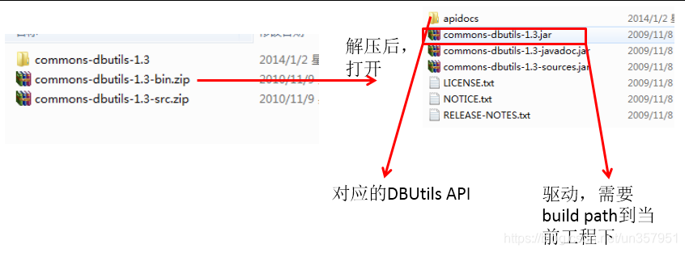
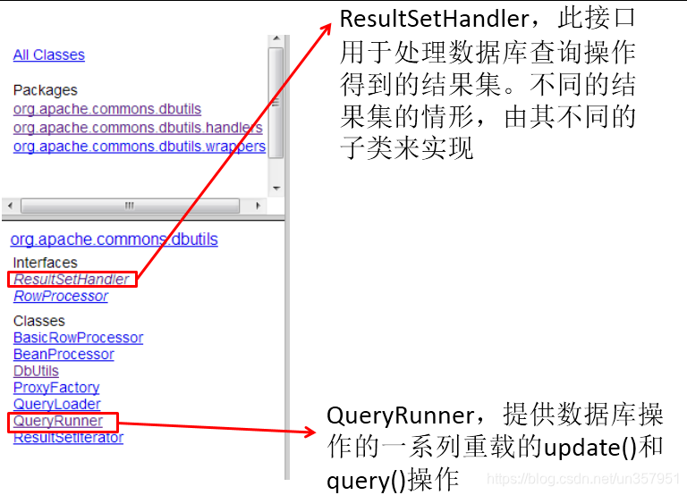

# 1. Apache-DBUtils简介
> **commons-dbutils** 是 Apache 组织提供的一个开源 JDBC工具类库，它是对 JDBC 的简单封装，学习成本极低， 并且使用 dbutils 能极大简化 jdbc 编码的工作量，同时也不会影响程序的性能。

# 2. 主要 API 的使用


## 2.1 DbUtils


- DbUtils ：提供如关闭连接、装载 JDBC 驱动程序等常规工作的工具类，里面的所有方法都是静态的。主要方法如下：
  - public static void close(…) throws java.sql.SQLException： DbUtils 类提供了三个重载的关闭方法。这些方法检查所提供的参数是不是 NULL，如果不是的话，它们就关闭 Connection、Statement 和 ResultSet。
  - public static void closeQuietly(…) : 这一类方法不仅能在 Connection、Statement 和 ResultSet 为 NULL情况下避免关闭，还能隐藏一些在程序中抛出的 SQLEeception。
  - public static void commitAndClose(Connection conn)throws SQLException： 用来提交连接的事务， 然后关闭连接。
  - public static void commitAndCloseQuietly(Connection conn)： 用来提交连接，然后关闭连接，并且在 关闭连接时不抛出 SQL 异常。
  - public static void rollback(Connection conn)throws SQLException：允许 conn 为 null，因为方法内部做了判断。
  - public static void rollbackAndClose(Connection conn)throws SQLException
  - rollbackAndCloseQuietly(Connection)
  - public static boolean loadDriver(java.lang.String driverClassName)：这一方装载并注册 JDBC 驱动程 序，如果成功就返回 true。使用该方法，你不需要捕捉这个异常 ClassNotFoundException。

```java
import java.sql.Connection;
import java.sql.SQLException;

import org.apache.commons.dbutils.DbUtils;
import org.apache.commons.dbutils.QueryRunner;
import org.junit.Test;

public class TestApacheDBUtils {
	@Test
	public void testTransaction() {
	    Connection conn = null;
	    try {
	    	//提供數據庫操作一系列重載的 update() 和 query()
	        QueryRunner runner = new QueryRunner(); 
	        
	        //獲取連接
	        conn = JDBCUtils.getConnection();
	        conn.setAutoCommit(false); // 開啟手動事務

	        String sql = "update user_table set balance = balance - 100 where `user` = ?";
	        int subCount = runner.update(conn, sql, "AA");
	        System.out.println("subCount: " + subCount);

	        // 模拟异常
	        System.out.println(10 / 0);

	        String sql2 = "update user_table set balance = balance + 100 where `user` = ?";
	        int addCount = runner.update(conn, sql2, "BB");
	        System.out.println("addCount: " + addCount);

	        conn.commit(); // 提交事務
	    } catch (Exception e) {
	        try {
	            DbUtils.rollback(conn);
	        } catch (SQLException ex) {
	            System.err.println("事務回滾失敗");
	            ex.printStackTrace();
	        }
	        throw new RuntimeException("事務執行異常", e);
	    } finally {
	        DbUtils.closeQuietly(conn); // 靜默關閉連接，不再拋出異常
	    }
	}

}
```

## 2.2 QueryRunner 类
> 该类简单化了 SQL 查询，它与 ResultSetHandler 组合在一起使用可以完成大部分的数据库操作，能够大大减少编码量。

### QueryRunner 类提供了两个构造器：
- 默认的构造器
- 需要一个 javax.sql.DataSource 来作参数的构造器

### QueryRunner类的主要方法：
- 更新
    - public int update(Connection conn, String sql, Object... params) throws SQLException:用来执行 一个更新（插入、更新或删除）操作。
    - ...
- 插入
    - public T insert(Connection conn,String sql,ResultSetHandler rsh, Object... params) throws SQLException：只支持INSERT语句，其中 rsh - The handler used to create the result object from the ResultSet of auto-generated keys. 返回值: An object generated by the handler.即自动生成的 键值
    - ...
- 批处理
    - public int[] batch(Connection conn,String sql,Object[][] params)throws SQLException： INSERT, UPDATE, or DELETE语句
    - public T insertBatch(Connection conn,String sql,ResultSetHandler rsh,Object[][] params)throws SQLException：只支持INSERT语句
    - ...
- 查询
    - public Object query(Connection conn, String sql, ResultSetHandler rsh,Object... params) throws SQLException：执行一个查询操作，在这个查询中，对象数组中的每个元素值被用来作为查询语句 的置换参数。该方法会自行处理 PreparedStatement 和 ResultSet 的创建和关闭。
    - ...

### 测试添加 :

```java
@Test
public void testInsert() {
    Connection conn = null;

    try {
        //提供數據庫操作一系列重載的 update() 和 query()
        QueryRunner runner = new QueryRunner();

        //獲取連接
        conn = JDBCUtils.getConnection();
        conn.setAutoCommit(false); // 開啟手動事務
        
        String sql = "insert into customers(name,email,birth)values(?,?,?)";

        //返回影響了幾行紀錄
        //如果你是事務中的一部分操作就需要把連接傳進去, 因為必須確保連接都是使用同一個
        int insertCount = runner.update(conn, sql, "蔡徐坤", "caixukun@126.com", "1997-09-08");
        
        conn.commit(); // 提交事務
        System.out.println("添加了" + insertCount + "条记录");
    } catch (Exception e) {
        try {
            DbUtils.rollback(conn);
        } catch (SQLException ex) {
            System.err.println("事務回滾失敗");
            ex.printStackTrace();
        }
        throw new RuntimeException("事務執行異常", e);
    } finally {
        DbUtils.closeQuietly(conn);
    }
}
```

### 测试删除 :

```java
@Test
public void testDelete() {
    Connection conn = null;

    try {
        //提供數據庫操作一系列重載的 update() 和 query()
        QueryRunner runner = new QueryRunner();

        //獲取連接
        conn = JDBCUtils.getConnection();
        conn.setAutoCommit(false); // 開啟手動事務
        
        String sql = "delete from customers where id = ?";

        //返回影響了幾行紀錄
        //如果你是事務中的一部分操作就需要把連接傳進去, 因為必須確保連接都是使用同一個
        int deleteCount = runner.update(conn, sql, 36);
        
        conn.commit(); // 提交事務
        System.out.println("刪除了" + deleteCount + "条记录");
    } catch (Exception e) {
        try {
            DbUtils.rollback(conn);
        } catch (SQLException ex) {
            System.err.println("事務回滾失敗");
            ex.printStackTrace();
        }
        throw new RuntimeException("事務執行異常", e);
    } finally {
        DbUtils.closeQuietly(conn);
    }
}
```

## 2.3 ResultSetHandler 接口及实现类
> 该接口用于处理 java.sql.ResultSet，将数据按要求转换为另一种形式。

- ResultSetHandler 接口提供了一个单独的方法：Object handle (java.sql.ResultSet .rs)。

### 接口的主要实现类：
- ArrayHandler：把结果集中的第一行数据转成对象数组。
- ArrayListHandler：把结果集中的每一行数据都转成一个数组，再存放到 List 中。 
- BeanHandler：将结果集中的第一行数据封装到一个对应的 JavaBean 实例中。 
- BeanListHandler：将结果集中的每一行数据都封装到一个对应的 JavaBean 实例中，存放到 List 里。 
- ColumnListHandler：将结果集中某一列的数据存放到 List 中。 
- KeyedHandler(name)：将结果集中的每一行数据都封装到一个 Map 里，再把这些 map 再存到一个 map 里，其 key 为指定的 key。 
- MapHandler：将结果集中的第一行数据封装到一个 Map 里，key 是列名，value 就是对应的值。 
- MapListHandler：将结果集中的每一行数据都封装到一个 Map 里，然后再存放到 List。
- ScalarHandler：查询单个值对象。


### BeanHander 測試 :
```java
// BeanHander:是ResultSetHandler接口的实现类，用于封装表中的一条记录。
@Test
public void testQueryInstance() {
    Connection conn = null;

    try {
        //提供數據庫操作一系列重載的 update() 和 query()
        QueryRunner runner = new QueryRunner();

        //獲取連接
        conn = JDBCUtils.getConnection();
        conn.setAutoCommit(false); // 開啟手動事務

        String sql = "select id,name,email,birth from customers where id = ?";

        //将结果集中的第一行数据封装到一个对应的JavaBean实例中
        BeanHandler<Customer> handler = new BeanHandler<>(Customer.class);

        //如果你是事務中的一部分操作就需要保連接傳進去, 因為必須確保連接都是使用同一個
        Customer customer = runner.query(conn, sql, handler, 35);
        
        conn.commit(); // 提交事務
        System.out.println(customer);
    } catch (Exception e) {
        try {
            DbUtils.rollback(conn);
        } catch (SQLException ex) {
            System.err.println("事務回滾失敗");
            ex.printStackTrace();
        }
        throw new RuntimeException("事務執行異常", e);
    } finally {
        DbUtils.closeQuietly(conn);
    }
}
```

### BeanListHandler 測試 :
```java
// BeanListHandler:是ResultSetHandler接口的实现类，用于封装表中的多条记录构成的集合。
@Test
public void testQueryList() {
    Connection conn = null;

    try {
        //提供數據庫操作一系列重載的 update() 和 query()
        QueryRunner runner = new QueryRunner();

        //獲取連接
        conn = JDBCUtils.getConnection();
        conn.setAutoCommit(false); // 開啟手動事務
        
        String sql = "select id,name,email,birth from customers where id < ?";

        //将结果集中的每一行数据都封装到一个对应的JavaBean实例中，存放到List里
        BeanListHandler<Customer> handler = new BeanListHandler<>(Customer.class);

        //如果你是事務中的一部分操作就需要保連接傳進去, 因為必須確保連接都是使用同一個
        List<Customer> list = runner.query(conn, sql, handler, 23);
        
        conn.commit(); // 提交事務
        list.forEach(System.out::println);
    } catch (Exception e) {
        try {
            DbUtils.rollback(conn);
        } catch (SQLException ex) {
            System.err.println("事務回滾失敗");
            ex.printStackTrace();
        }
        throw new RuntimeException("事務執行異常", e);
    } finally {
        DbUtils.closeQuietly(conn);
    }
}
```

### MapHander 測試 :
```java
//MapHander:是ResultSetHandler接口的实现类，对应表中的一条记录。将字段及相应字段的值作为map中的key和value
@Test
public void testMapHander() {
    Connection conn = null;
    try {
        //提供數據庫操作一系列重載的 update() 和 query()
        QueryRunner runner = new QueryRunner();

        //獲取連接
        conn = JDBCUtils.getConnection();
        conn.setAutoCommit(false); // 開啟手動事務

        conn = JDBCUtils.getConnection();
        String sql = "select id,name,email,birth from customers where id = ?";

        MapHandler handler = new MapHandler();

        Map<String, Object> map = runner.query(conn, sql, handler, 30);
        
        conn.commit(); // 提交事務
        System.out.println(map);
    } catch (Exception e) {
        try {
            DbUtils.rollback(conn);
        } catch (SQLException ex) {
            System.err.println("事務回滾失敗");
            ex.printStackTrace();
        }
        throw new RuntimeException("事務執行異常", e);
    } finally {
        DbUtils.closeQuietly(conn);
    }
}
```

### MapListHander 測試 :

```java
// MapListHander:是ResultSetHandler接口的实现类，对应表中的多条记录。将字段及相应字段的值作为map中的key和value。将这些map添加到List中
@Test
public void testMapListHander() {
    Connection conn = null;
    try {
        //提供數據庫操作一系列重載的 update() 和 query()
        QueryRunner runner = new QueryRunner();

        //獲取連接
        conn = JDBCUtils.getConnection();
        conn.setAutoCommit(false); // 開啟手動事務
        
        String sql = "select id,name,email,birth from customers where id < ?";

        MapListHandler handler = new MapListHandler();
        List<Map<String, Object>> list = runner.query(conn, sql, handler, 23);
        
        conn.commit(); // 提交事務
        list.forEach(System.out::println);
    } catch (Exception e) {
        try {
            DbUtils.rollback(conn);
        } catch (SQLException ex) {
            System.err.println("事務回滾失敗");
            ex.printStackTrace();
        }
        throw new RuntimeException("事務執行異常", e);
    } finally {
        DbUtils.closeQuietly(conn);
    }
}
```

### ScalarHandler 測試 :

```java
// ScalarHandler:用于查询特殊值
@Test
public void testScalarHandler() {
    Connection conn = null;

    try {
        //提供數據庫操作一系列重載的 update() 和 query()
        QueryRunner runner = new QueryRunner();

        //獲取連接
        conn = JDBCUtils.getConnection();
        conn.setAutoCommit(false); // 開啟手動事務

        String sql = "select count(*) from customers";

        ScalarHandler handler = new ScalarHandler();

        Long count = (Long) runner.query(conn, sql, handler);
        
        conn.commit(); // 提交事務
        System.out.println(count);
    } catch (Exception e) {
        try {
            DbUtils.rollback(conn);
        } catch (SQLException ex) {
            System.err.println("事務回滾失敗");
            ex.printStackTrace();
        }
        throw new RuntimeException("事務執行異常", e);
    } finally {
        DbUtils.closeQuietly(conn);
    }
}

@Test
public void testScalarHandler2() {
    Connection conn = null;

    try {
        //提供數據庫操作一系列重載的 update() 和 query()
        QueryRunner runner = new QueryRunner();

        //獲取連接
        conn = JDBCUtils.getConnection();
        conn.setAutoCommit(false); // 開啟手動事務

        String sql = "select max(birth) from customers";

        ScalarHandler handler = new ScalarHandler();
        Date maxBirth = (Date) runner.query(conn, sql, handler);
        
        conn.commit(); // 提交事務
        System.out.println(maxBirth);
    } catch (Exception e) {
        try {
            DbUtils.rollback(conn);
        } catch (SQLException ex) {
            System.err.println("事務回滾失敗");
            ex.printStackTrace();
        }
        throw new RuntimeException("事務執行異常", e);
    } finally {
        DbUtils.closeQuietly(conn);
    }
}
```

### ResultSetHandler 測試 :

```java
// 自定义ResultSetHandler的实现类
@Test
public void testResultSetHandler() {
    Connection conn = null;

    try {
        //提供數據庫操作一系列重載的 update() 和 query()
        QueryRunner runner = new QueryRunner();

        //獲取連接
        conn = JDBCUtils.getConnection();
        conn.setAutoCommit(false); // 開啟手動事務

        String sql = "select id,name,email,birth from customers where id = ?";

        //匿名實現類
        ResultSetHandler<Customer> handler = new ResultSetHandler<Customer>() {
            //這個方法返回的返回值, 就是要數據將要封裝的對象
            @Override
            public Customer handle(ResultSet rs) throws SQLException {
                // rs: 就是對應查詢表的結果集
                if (rs.next()) {
                    int id = rs.getInt("id");
                    String name = rs.getString("name");
                    String email = rs.getString("email");
                    Date birth = rs.getDate("birth");
                    Customer customer = new Customer(id, name, email, birth);
                    return customer;
                }
                return null;
            }
        };

        Customer customer = runner.query(conn, sql, handler, 30);
        
        conn.commit(); // 提交事務
        System.out.println(customer);
    } catch (Exception e) {
        try {
            DbUtils.rollback(conn);
        } catch (SQLException ex) {
            System.err.println("事務回滾失敗");
            ex.printStackTrace();
        }
        throw new RuntimeException("事務執行異常", e);
    } finally {
        DbUtils.closeQuietly(conn);
    }
}
```