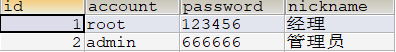
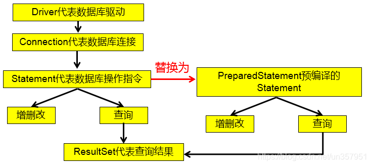

# 1. 基于 statement 演示查询
> 通过调用 **Connection** 对象的 `createStatement()` 方法创建该对象。该对象用于执行静态的 SQL 语句，并且返 回执行结果。

- `Statement` 接口中定义了下列方法用于执行 SQL 语句：
### 🔹 `int executeQuery(String sql)`
- **用途**：用於執行查詢語句（即 **DQL**，例如 `SELECT`）。
- **返回值**：回傳一個 `ResultSet` 物件，表示查詢結果集。
- **使用場景**：當你需要從資料庫中**查詢資料**，例如登入驗證、撈出使用者列表、商品清單等。

---

### 🔹 `ResultSet executeUpdate(String sql)`
- **用途**：用於執行 **更新類型的 SQL**（包括 `INSERT`、`UPDATE`、`DELETE` 等）。
- **返回值**：回傳一個 `int`，表示受影響的行數。
- **使用場景**：當你需要對資料庫**新增、修改或刪除**資料。

✅ 範例：
```java
String sql = "UPDATE t_user SET password='123456' WHERE account='admin'";
int rows = statement.executeUpdate(sql);
System.out.println("更新了 " + rows + " 行資料");
```

---

### 🔹 `boolean execute(String sql)`
**執行任意 SQL 語句**  
- 如果是查詢語句（`SELECT`），返回 `true`
- 如果是更新語句（`INSERT/UPDATE/DELETE`），返回 `false`
- 查詢結果可以用 `getResultSet()` 取得
- 更新結果可以用 `getUpdateCount()` 取得

### 🔹 `ResultSet`
- **用途**：代表查詢出來的資料表，類似於一個“虛擬表格”。
- **內部機制**：預設情況下，`ResultSet` 的指標會在第一行的 **前面**，必須透過 `next()` 移動到下一行才能讀取資料。
- **常用方法**：
  - `next()`：移動到下一行，回傳 `true` 表示有資料，否則 `false`。
  - `getXXX(String columnLabel)`：根據欄位名稱獲取當前列的值。
  - `getXXX(int columnIndex)`：根據欄位索引獲取值（從 **1 開始**）。

---

### 基于statement实现查询 **(演示步骤)**
#### 准备数据库数据
```sql
CREATE DATABASE atguigu;

USE atguigu;

CREATE TABLE t_user(
   id INT PRIMARY KEY AUTO_INCREMENT COMMENT '用户主键',
   account VARCHAR(20) NOT NULL UNIQUE COMMENT '账号',
   password VARCHAR(64) NOT NULL COMMENT '密码',
   nickname VARCHAR(20) NOT NULL COMMENT '昵称');

INSERT INTO t_user(account,password,nickname) VALUES
  ('root','123456','经理'),('admin','666666','管理员');
```

#### 查询目标
查询全部用户信息，进行控制台输出


#### 程式碼如下
```java
import java.sql.Connection;
import java.sql.DriverManager;
import java.sql.ResultSet;
import java.sql.SQLException;
import java.sql.Statement;

import com.mysql.cj.jdbc.Driver;

/**
 * @Author 赵伟风
 * Description: 利用jdbc技术,完成用户数据查询工作
 *
 * TODO: 步骤总结 (6步)
 *    1. 注册驱动
 *    2. 获取连接
 *    3. 创建statement
 *    4. 发送SQL语句,并获取结果
 *    5. 结果集解析
 *    6. 关闭资源
 */
public class JdbcBasePart {

    public static void main(String[] args) throws SQLException {

        //1.注册驱动
        /**
         * TODO: 注意
         *   Driver -> com.mysql.cj.jdbc.Driver
         */
        DriverManager.registerDriver(new Driver());

        //2.获取连接
        /**
         * TODO: 注意
         *   面向接口编程
         *   java.sql 接口 = 实现类
         *   connection 使用java.sql.Connection接口接收
         */
        Connection connection = DriverManager.getConnection("jdbc:mysql://localhost:3306/test",
                "root",
                "Lins860210SStar");

        //3.创建小车
        Statement statement = connection.createStatement();

        //4.发送SQL语句
        String sql = "select id,account,password,nickname from t_user ;";
        ResultSet resultSet =  statement.executeQuery(sql);

        //5.结果集解析
        while (resultSet.next()){
            int id = resultSet.getInt("id");
            String account = resultSet.getString("account");
            String password = resultSet.getString("password");
            String nickname = resultSet.getString("nickname");
            System.out.println(id+"::"+account+"::"+password+"::"+nickname);
        }

        //6.关闭资源  【先开后关】
        resultSet.close();
        statement.close();
        connection.close();
    }
}
```

# 2. 使用 Statement 操作数据表的弊端
1. 问题一：存在拼串操作，繁琐
2. 问题二：存在 SQL 注入问题
3. 问题三 : Statement 不能操作 BLOB 类型
4. 问题四 : Statement 实现批量插入时，效率较低

> **SQL 注入** 是利用某些系统没有对用户输入的数据进行充分的检查，而在用户输入数据中注入非法的 SQL 语句段或命令，从而利用系统的 SQL 引擎完成恶意行为的做法。

> 对于 Java 而言，要防范 SQL 注入，只要用 **PreparedStatement** (从 **Statement** 扩展而来) 取代 **Statement** 就可以了。
> - 

### 准备数据库数据
> 上个案例相同的数据库

```sql
CREATE DATABASE atguigu;

USE atguigu;

CREATE TABLE t_user(
   id INT PRIMARY KEY AUTO_INCREMENT COMMENT '用户主键',
   account VARCHAR(20) NOT NULL UNIQUE COMMENT '账号',
   PASSWORD VARCHAR(64) NOT NULL COMMENT '密码',
   nickname VARCHAR(20) NOT NULL COMMENT '昵称');

INSERT INTO t_user(account,PASSWORD,nickname) VALUES
  ('root','123456','经理'),('admin','666666','管理员');
```

### 演示目标
模拟登录，控制台输入账号和密码，判断是否登陆成功成功!


### 演示 SQL 注入問題 
> **說明:**
> - 我們明明想要表達的是用戶名必須是 `1' or`  並且密碼是 `=1 or '1' = '1`
> - 但是這條 SQL 語句傳送到數據庫就會變成是 `user = 1` 或者 `' AND password = '= 1` 或者 `'1' = '1'`

```java
import java.io.IOException;
import java.io.InputStream;
import java.sql.Connection;
import java.sql.DriverManager;
import java.sql.ResultSet;
import java.sql.SQLException;
import java.sql.Statement;
import java.util.Properties;
import java.util.Scanner;

import connection.ConnectionTest;

public class JdbcStatementLoginPart {

    public static void main(String[] args) throws ClassNotFoundException, SQLException, IOException {

        //1.输入账号和密码
        Scanner scanner = new Scanner(System.in);
        String account = scanner.nextLine();
        String password = scanner.nextLine();
        scanner.close();

        //2.jdbc的查询使用
	    //读取配置文件中的4个基本信息
	    InputStream is = ConnectionTest.class.getClassLoader().getResourceAsStream("jdbc.properties");

	    Properties pros = new Properties();
	    pros.load(is);

	    String user = pros.getProperty("user");
	    String pwd = pros.getProperty("password");
	    String url = pros.getProperty("url");
	    String driverClass = pros.getProperty("driverClass");
	    
        //注册一次驱动
	    Class.forName(driverClass);

        //获取连接
	    Connection connection = DriverManager.getConnection(url, user, pwd);
	    
        //创建statement
        Statement statement = connection.createStatement();

        //执行SQL语句 [动态SQL语句,需要字符串拼接]
        String sql = "select * from t_user where account = '"+account+"' and password = '"+ password+"' ;";

        ResultSet resultSet = statement.executeQuery(sql);

        //进行结果集对象解析
        if (resultSet.next()){
            //只要向下移动，就是有数据 就是登录成功！
            System.out.println("登录成功！");
        }else{
            System.out.println("登录失败！");
        }

        //关闭资源
        resultSet.close();
        statement.close();
        connection.close();
    }
}
```